<style>
body {
  background-color: #383232;
  text-align: justify;
}
 header {
 background: linear-gradient(to right, #d9e021 0%, 8.152174204587936%, #67c39d 16.304348409175873%, 22.677866369485855%, #67c39d 29.051384329795837%, 40.01976400613785%, #03b3d8 50.98814368247986%, 75.00790619850159%, #ed028d 81.02766871452332%, 100%);
 text-shadow : black 0px 5px 20px;
 }
</style>

```{r setup, include=FALSE}
knitr::opts_chunk$set(
  echo = FALSE,
  message = FALSE,
  warning = FALSE,
  fig.align="center"
)
rmarkdown::find_pandoc(version = '2.18')
```
## I. Introduction

### I.1. Contexte

Nous avons selectionné un data set se nommant : "World Hapiness Report up to 2022". Celui-ci classe 155 pays en fonction de leur niveau de bonheur. Le premier rapport a été publié en 2012. En ce qui nous concerne, nous souhaitons étudier les rapports de 2015 à 2022.

Ces données proviennent du site Kaggle (disponible sur ce [lien](https://www.kaggle.com/datasets/ajaypalsinghlo/world-happiness-report-2022)) dont l'auteur ***Mathurin Aché*** les a extraites des "[World Happiness Report](https://worldhappiness.report/)", publiés par le Earth Institute. 
<p align="center">

</p>


Les données sont tirées des sondages du [Gallup World Poll](https://www.gallup.com/analytics/318875/global-research.aspx). Elles sont basées sur les réponses à la principale question d'évaluation de la vie posée dans les sondages. Appelée l'échelle de Cantril, elle demande aux personnes interrogées de penser à une échelle, la meilleure vie possible pour elles étant un 10 et la pire étant un 0. Il leur est ensuite demandé d'évaluer leur propre vie actuelle sur cette échelle de 0 à 10. Les classements sont issus d'échantillons représentatifs au niveau national.

<p align="center">
<br>

</p>

Nous avons choisi pour ce projet d'analyser ces rapports car ils sont reconnu mondialement. En effet, ils peuvent être utilisés par les gouvernements et les organisations pour éclairer leur choix politiques. De plus, ces données nous parraissaient intéresssantes à étudier, puisque des experts décisionnaires les utilisent également dans de nombreux domaines : 

- Questions financières
- Recherche sur le cerveau
- Enquête générale
- Perspectives nationales 
- Bien-être

Ceux-ci permettent de donner des estimations du bien-être et évaluer les progrès des pays. Ainsi, nous pensons que l'étude et la visualisation des données contenues dans ce dataset nous permettrait de mettre en lien les différents paramètres pouvant influer sur le bonheur des pays.

### I.2. Description détaillée des données

#### 2.1. Description des variables

Notre dataset est composé de 7 fichiers au format *.csv*, chacun représentant respectivement les données de chacunes des années de 2015 à 2022 d'au moins 146 pays. Les différentes variables que nous pouvons retrouver et exploiter dans notre dataset sont :

1.   `Country name` : Il s'agit du nom du pays évalué

2.   `Regional indicator` : Un indicateur précisant la région du monde dans laquelle se trouve le pays observé

3.   `Ladder score` : Médiane du score du bonheur donné dans les sondages

4.   `Standard error of ladder score` : L'erreur estimée sur le score du bonheur 

5.   `upperwhisker` : Le maximum du boxplot des réponses données dans les sondages

6.   `lowerwhisker` : Le minimum du boxplot des réponse données dans les sondages

7.   `Logged GDP per capita` : Le PIB (Produit Intérieur Brut) par habitants dans le pays

8.   `Social support` : Notion polysémique qui désigne l'intégration d'un individu divisé par le nombre de relation avec autrui 

9.  `Healthy life expectancy` : L'espérance de vie moyenne dans le pays concerné

10.  `Freedom to make life choices` : Score désignant la liberté des choix de vie de la population

11.  `Generosity` : Le score de la générosité de la population dans le pays

12.  `Perceptions of corruption` : Le score représentant la perception de la corruption dans le pays de la population

13.  `Ladder score in Dystopia` : Moyenne de score de bonheur dans le cas d'une Dystopie

14.  `Explained by: Log GDP per capita` : Part du score du bonheur expliqué par le PIB par habitants

15.  `Explained by: Social support` : Part du score du bonheur expliqué par le support social

16.  `Explained by: Healthy life expectancy` : Part du score du bonheur expliqué par l'espérance de vie

17.  `Explained by: Freedom to make life choices` : Part du score du bonheur expliqué par la liberté de choix de vie

18.  `Explained by: Generosity` : Part du score du bonheur expliqué par la générosité

19.  `Explained by: Perceptions of corruption` : Part du score du bonheur expliqué par la corruption

20.  `Dystopia + residual` : Restant des parts du score du bonheur pouvant être expliqué par le score du bonheur dans une le cas d'une Dystopie ajouté aux résidus                

#### 2.2. Description des données au sein des fichiers du dataset
Voici la description des variables pour chacunes des années du dataset : 


##### 2015

~~~~~~~~~~~~~~~~~~~~~~~~~~~~~~~~~~~~~~~~~~~~~~~~~~~~~~~~~~~~~~~~~~~~~~~~~~~
158 individus
12 variables
 #   Variables                      Non-Null Count  Dtype  
---  ------                         --------------  -----  
 0   Country                        158 non-null    object 
 1   Region                         158 non-null    object 
 2   Happiness Rank                 158 non-null    int64  
 3   Happiness Score                158 non-null    float64
 4   Standard Error                 158 non-null    float64
 5   Economy (GDP per Capita)       158 non-null    float64
 6   Family                         158 non-null    float64
 7   Health (Life Expectancy)       158 non-null    float64
 8   Freedom                        158 non-null    float64
 9   Trust (Government Corruption)  158 non-null    float64
 10  Generosity                     158 non-null    float64
 11  Dystopia Residual              158 non-null    float64
~~~~~~~~~~~~~~~~~~~~~~~~~~~~~~~~~~~~~~~~~~~~~~~~~~~~~~~~~~~~~~~~~~~~~~~~~~~

##### 2016
~~~~~~~~~~~~~~~~~~~~~~~~~~~~~~~~~~~~~~~~~~~~~~~~~~~~~~~~~~~~~~~~~~~~~~~~~~~
157 individus
13 variables
 #   Variables                      Non-Null Count  Dtype  
---  ------                         --------------  -----  
 0   Country                        157 non-null    object 
 1   Region                         157 non-null    object 
 2   Happiness Rank                 157 non-null    int64  
 3   Happiness Score                157 non-null    float64
 4   Lower Confidence Interval      157 non-null    float64
 5   Upper Confidence Interval      157 non-null    float64
 6   Economy (GDP per Capita)       157 non-null    float64
 7   Family                         157 non-null    float64
 8   Health (Life Expectancy)       157 non-null    float64
 9   Freedom                        157 non-null    float64
 10  Trust (Government Corruption)  157 non-null    float64
 11  Generosity                     157 non-null    float64
 12  Dystopia Residual              157 non-null    float64
~~~~~~~~~~~~~~~~~~~~~~~~~~~~~~~~~~~~~~~~~~~~~~~~~~~~~~~~~~~~~~~~~~~~~~~~~~~

##### 2017
~~~~~~~~~~~~~~~~~~~~~~~~~~~~~~~~~~~~~~~~~~~~~~~~~~~~~~~~~~~~~~~~~~~~~~~~~~~
155 individus
12 variables
 #   Variables                      Non-Null Count  Dtype  
---  ------                         --------------  -----  
 0   Country                        155 non-null    object 
 1   Happiness.Rank                 155 non-null    int64  
 2   Happiness.Score                155 non-null    float64
 3   Whisker.high                   155 non-null    float64
 4   Whisker.low                    155 non-null    float64
 5   Economy..GDP.per.Capita.       155 non-null    float64
 6   Family                         155 non-null    float64
 7   Health..Life.Expectancy.       155 non-null    float64
 8   Freedom                        155 non-null    float64
 9   Generosity                     155 non-null    float64
 10  Trust..Government.Corruption.  155 non-null    float64
 11  Dystopia.Residual              155 non-null    float64
~~~~~~~~~~~~~~~~~~~~~~~~~~~~~~~~~~~~~~~~~~~~~~~~~~~~~~~~~~~~~~~~~~~~~~~~~~~

##### 2018
~~~~~~~~~~~~~~~~~~~~~~~~~~~~~~~~~~~~~~~~~~~~~~~~~~~~~~~~~~~~~~~~~~~~~~~~~~~
156 individus
9 variables
 #   Variables                     Non-Null Count  Dtype  
---  ------                        --------------  -----  
 0   Overall rank                  156 non-null    int64  
 1   Country or region             156 non-null    object 
 2   Score                         156 non-null    float64
 3   GDP per capita                156 non-null    float64
 4   Social support                156 non-null    float64
 5   Healthy life expectancy       156 non-null    float64
 6   Freedom to make life choices  156 non-null    float64
 7   Generosity                    156 non-null    float64
 8   Perceptions of corruption     155 non-null    float64
~~~~~~~~~~~~~~~~~~~~~~~~~~~~~~~~~~~~~~~~~~~~~~~~~~~~~~~~~~~~~~~~~~~~~~~~~~~

##### 2019
~~~~~~~~~~~~~~~~~~~~~~~~~~~~~~~~~~~~~~~~~~~~~~~~~~~~~~~~~~~~~~~~~~~~~~~~~~~
156 individus
9 variables
 #   Variables                     Non-Null Count  Dtype  
---  ------                        --------------  -----  
 0   Overall rank                  156 non-null    int64  
 1   Country or region             156 non-null    object 
 2   Score                         156 non-null    float64
 3   GDP per capita                156 non-null    float64
 4   Social support                156 non-null    float64
 5   Healthy life expectancy       156 non-null    float64
 6   Freedom to make life choices  156 non-null    float64
 7   Generosity                    156 non-null    float64
 8   Perceptions of corruption     156 non-null    float64
~~~~~~~~~~~~~~~~~~~~~~~~~~~~~~~~~~~~~~~~~~~~~~~~~~~~~~~~~~~~~~~~~~~~~~~~~~~

##### 2020
~~~~~~~~~~~~~~~~~~~~~~~~~~~~~~~~~~~~~~~~~~~~~~~~~~~~~~~~~~~~~~~~~~~~~~~~~~~
153 individus
20 variables
 #   Variables                                   Non-Null Count  Dtype  
---  ------                                      --------------  -----  
 0   Country name                                153 non-null    object 
 1   Regional indicator                          153 non-null    object 
 2   Ladder score                                153 non-null    float64
 3   Standard error of ladder score              153 non-null    float64
 4   upperwhisker                                153 non-null    float64
 5   lowerwhisker                                153 non-null    float64
 6   Logged GDP per capita                       153 non-null    float64
 7   Social support                              153 non-null    float64
 8   Healthy life expectancy                     153 non-null    float64
 9   Freedom to make life choices                153 non-null    float64
 10  Generosity                                  153 non-null    float64
 11  Perceptions of corruption                   153 non-null    float64
 12  Ladder score in Dystopia                    153 non-null    float64
 13  Explained by: Log GDP per capita            153 non-null    float64
 14  Explained by: Social support                153 non-null    float64
 15  Explained by: Healthy life expectancy       153 non-null    float64
 16  Explained by: Freedom to make life choices  153 non-null    float64
 17  Explained by: Generosity                    153 non-null    float64
 18  Explained by: Perceptions of corruption     153 non-null    float64
 19  Dystopia + residual                         153 non-null    float64
~~~~~~~~~~~~~~~~~~~~~~~~~~~~~~~~~~~~~~~~~~~~~~~~~~~~~~~~~~~~~~~~~~~~~~~~~~~

##### 2021
~~~~~~~~~~~~~~~~~~~~~~~~~~~~~~~~~~~~~~~~~~~~~~~~~~~~~~~~~~~~~~~~~~~~~~~~~~~
149 individus
20 variables
 #   Variables                                   Non-Null Count  Dtype  
---  ------                                      --------------  -----  
 0   Country name                                149 non-null    object 
 1   Regional indicator                          149 non-null    object 
 2   Ladder score                                149 non-null    float64
 3   Standard error of ladder score              149 non-null    float64
 4   upperwhisker                                149 non-null    float64
 5   lowerwhisker                                149 non-null    float64
 6   Logged GDP per capita                       149 non-null    float64
 7   Social support                              149 non-null    float64
 8   Healthy life expectancy                     149 non-null    float64
 9   Freedom to make life choices                149 non-null    float64
 10  Generosity                                  149 non-null    float64
 11  Perceptions of corruption                   149 non-null    float64
 12  Ladder score in Dystopia                    149 non-null    float64
 13  Explained by: Log GDP per capita            149 non-null    float64
 14  Explained by: Social support                149 non-null    float64
 15  Explained by: Healthy life expectancy       149 non-null    float64
 16  Explained by: Freedom to make life choices  149 non-null    float64
 17  Explained by: Generosity                    149 non-null    float64
 18  Explained by: Perceptions of corruption     149 non-null    float64
 19  Dystopia + residual                         149 non-null    float64
~~~~~~~~~~~~~~~~~~~~~~~~~~~~~~~~~~~~~~~~~~~~~~~~~~~~~~~~~~~~~~~~~~~~~~~~~~~

##### 2022
~~~~~~~~~~~~~~~~~~~~~~~~~~~~~~~~~~~~~~~~~~~~~~~~~~~~~~~~~~~~~~~~~~~~~~~~~~~
147 individus
12 variables
 #   Variables                                   Non-Null Count  Dtype  
---  ------                                      --------------  -----  
 0   RANK                                        147 non-null    int64 
 1   Country                                     147 non-null    object
 2   Happiness score                             146 non-null    object
 3   Whisker-high                                146 non-null    object
 4   Whisker-low                                 146 non-null    object
 5   Dystopia (1.83) + residual                  146 non-null    object
 6   Explained by: GDP per capita                146 non-null    object
 7   Explained by: Social support                146 non-null    object
 8   Explained by: Healthy life expectancy       146 non-null    object
 9   Explained by: Freedom to make life choices  146 non-null    object
 10  Explained by: Generosity                    146 non-null    object
 11  Explained by: Perceptions of corruption     146 non-null    object
~~~~~~~~~~~~~~~~~~~~~~~~~~~~~~~~~~~~~~~~~~~~~~~~~~~~~~~~~~~~~~~~~~~~~~~~~~~


## II. Plan d'analyse

Comme décrit précédemment, ce data set contient au minimum une dizaine de variables par année, ainsi, il serait intéressant de comparer les variables qui sont similaires par année et d'observer leur évolution par pays. En effet, cette première analyse pourra nous permettre de visualiser comment un événement peut impacter le bonheur des populations en fonction d'où ils se trouvent dans le monde. On peut prendre l'exemple du COVID, quel impact a-t-il eu sur les différentes populations et sinon pourquoi ? Comment l'expliquer ? Les mesures étaient elles les mêmes ?

De plus, nous souhaitons également analyser et comparer des variables telles que la générosité des populations dans des pays instables ou en guerre avec des pays dit en paix. Cette analyse permettrait de visualiser l'entraide et le soutien naturel durant les situations de crises. D'autre part, nous pouvons par exemple mener une analyse sur la variable de Happiness score ou l'espérance de vie moyenne et les comparer à différentes régions du monde, on pourrait ainsi en déduire que le climat, la zone géographique peut influer sur le bonheur et l'espérance de vie moyenne.

Enfin, il serait intéressant d'étudier les corrélations entre différentes variables sur plusieurs années, telles que l'étude de la durée de vie moyenne avec la générosité ou le Happiness score. Cette étude de corrélation pourrait ainsi nous permettre d'observer que plus on est heureux, plus notre espérance de vie est élevée.


En somme, nous souhaitons :

- Étudier l'évolution des différentes variables communes en fonction des années,


- Comparer les variables sur différents types de pays, régions du monde,


- Analyser les corrélations entre différentes variables ou individus.


À noter que certaines variables ne sont pas comparées de la même manière en fonction des différentes années, on peut prendre l'exemple de la variable Happinness score en 2015, dont on donne la variance alors qu'en 2016, un intervalle de confiance a été calculé. Ainsi, il faudra traiter nos données de sorte que ce type de différences, ne pose pas problème lors des visualisations. Nous devrons donc faire attention au sens et à l'exploitation des variables en fonction des différentes années.


## III) Exploration
### A. Data Cleaning

Afin d'effectuer des visualisations sur les différents datasets concernant les scores du bonheur, de générosité, de corruption, etc., dans le monde entre 2015 et 2021, nous devons effectuer un pré-traitement des données. En effet, les datasets ne peuvent pas être utilisés dans l'état, car ils ne sont pas organisés de la même manière et certaines données sont parfois manquantes.

Dans un premier temps, les données seront donc standardisées de sorte que :

- Le nom de chaque variable soit le même dans tous les datasets. En effet, les variables ne sont pas toutes les mêmes en fonction des années et certaines n'existent tout simplement pas d'une année à l'autre,

- Les variables soient calculées de la même manière dans chacun des datasets. Ainsi, on normalisera le *PIB* et le *Score de Corruption* qui ne sont pas calculés de la même manière pour différentes années, il faudra également modifier le *Score d'espérance de vie* en 2020 et 2021,

- Chaque pays sera associé à une même région dans chacun des datasets,

- Enfin, une dernière colonne est ajoutée à chacun des datasets contenant l'année de prise des observations. Celle-ci permettra de faire des analyses sur plusieurs années et ainsi d'étudier les évolutions pour différents scores.

Une fois ces modifications faites, il sera plus aisé de créer des visualisations et de les interpréter.


```{r}
df2015<- read.csv('data/2015.csv')
df2016<- read.csv('data/2016.csv')
df2017<- read.csv('data/2017.csv')
df2018<- read.csv('data/2018.csv')
df2019<- read.csv('data/2019.csv')
df2020<- read.csv('data/2020.csv')
df2021<- read.csv('data/2021.csv')
```


```{r}
##### A.1) Cleaning dataset 2015
#Normalisation du GDP_Score et Corruption_Score
df2015$Economy..GDP.per.Capita.<-scale(df2015$Economy..GDP.per.Capita.)
df2015$Trust..Government.Corruption.<-scale(df2015$Trust..Government.Corruption.)

#Changement des noms des colonnes
colnames(df2015) <- c('Country', 'Region', 'Happiness_Rank', 'Happiness_Score', 'ste_Happiness_Score', 'GDP_Score', 'Social_Score', 'Life_Expectancy_Score', 'Freedom_Score', 'Corruption_Score', 'Generosity_Score', 'Dystopia_Residual')


#Faire en sorte d'avoir les mêmes régions
for (i in 1:nrow(df2015)){
  if (df2015$Region[i] %in% c("North America", "Australia and New Zealand")){
    df2015$Region[i] <- "North America and ANZ"
  }
}
```


```{r}
#### A.2) Cleaning dataset 2016
#Normalisation du GDP_Score et Corruption_Score
df2016$Economy..GDP.per.Capita.<-scale(df2016$Economy..GDP.per.Capita.)
df2016$Trust..Government.Corruption.<-scale(df2016$Trust..Government.Corruption.)

#Changement des noms des colonnes
colnames(df2016) <- c('Country', 'Region', 'Happiness_Rank', 'Happiness_Score','LCI_Happiness_Score','UCI_Happiness_Score', 'GDP_Score', 'Social_Score', 'Life_Expectancy_Score', 'Freedom_Score', 'Corruption_Score', 'Generosity_Score', 'Dystopia_Residual')

#Faire en sorte d'avoir les mêmes régions
regions <- c()
for (i in df2016$Country) {
  if (i %in% df2015$Country) {
    regions <- c(regions, df2015[df2015$Country == i,]$Region)
  }
  else {
    regions <- c(regions, "NA")
  }
}
df2016$Region <- regions
```


```{r}
#### A.3) Cleaning dataset 2017
#Normalisation du GDP_Score et Corruption_Score
df2017$Economy..GDP.per.Capita.<-scale(df2017$Economy..GDP.per.Capita.)
df2017$Trust..Government.Corruption.<-scale(df2017$Trust..Government.Corruption.)

#Changement de nom de deux pays--> Unifier
df2017[df2017$Country == 'Hong Kong S.A.R., China',]$Country <- 'Hong Kong'
df2017[df2017$Country == 'Taiwan Province of China',]$Country <- 'Taiwan'

#Faire en sorte d'avoir les mêmes régions
regions <- c()
for (i in df2017$Country) {
  if (i %in% df2015$Country) {
    regions <- c(regions, df2015[df2015$Country == i,]$Region)
  }
  else {
    regions <- c(regions, "NA")
  }
}
df2017$Region <- regions
```


```{r}
#Changement des noms des colonnes
colnames(df2017) <- c('Country', 'Happiness_Rank', 'Happiness_Score','UCI_Happiness_Score','LCI_Happiness_Score', 'GDP_Score', 'Social_Score', 'Life_Expectancy_Score', 'Freedom_Score', 'Generosity_Score', 'Corruption_Score', 'Dystopia_Residual', 'Region')
```


```{r}
#### A.4) Cleaning dataset 2018
#Normalisation du GDP_Score et Corruption_Score
df2018$GDP.per.capita<-scale(df2018$GDP.per.capita)
df2018$Perceptions.of.corruption<-scale(as.numeric(df2018$Perceptions.of.corruption))

#Faire en sorte d'avoir les mêmes régions
regions <- c()
for (i in df2018$Country) {
  if (i %in% df2015$Country) {
    regions <- c(regions, df2015[df2015$Country == i,]$Region)
  }
  else {
    regions <- c(regions, "NA")
  }
}
df2018$Region <- regions
```

```{r}
#Changement des noms des colonnes
colnames(df2018) <- c('Happiness_Rank', 'Country', 'Happiness_Score', 'GDP_Score', 'Social_Score', 'Life_Expectancy_Score', 'Freedom_Score', 'Generosity_Score', 'Corruption_Score', 'Region')
```


```{r}
#### A.5) Cleaning dataset 2019
#Normalisation du GDP_Score et Corruption_Score
df2019$GDP.per.capita<-scale(df2019$GDP.per.capita)
df2019$Perceptions.of.corruption<-scale(df2019$Perceptions.of.corruption)

#Faire en sorte d'avoir les mêmes régions
regions <- c()
for (i in df2019$Country) {
  if (i %in% df2015$Country) {
    regions <- c(regions, df2015[df2015$Country == i,]$Region)
  }
  else {
    regions <- c(regions, "NA")
  }
}
df2019$Region <- regions
```

```{r}
#Changement des noms des colonnes
colnames(df2019) <- c('Happiness_Rank', 'Country', 'Happiness_Score', 'GDP_Score', 'Social_Score', 'Life_Expectancy_Score', 'Freedom_Score', 'Generosity_Score', 'Corruption_Score', 'Region')
```


```{r}
#### A.6) Cleaning dataset 2020
#Normalisation du GDP_Score et Corruption_Score
df2020$Healthy.life.expectancy<-(df2020$Healthy.life.expectancy/100)
df2020$Logged.GDP.per.capita<-scale(df2020$Logged.GDP.per.capita)
df2020$Perceptions.of.corruption<-scale(1-df2020$Perceptions.of.corruption)

#Changement des noms des colonnes
colnames(df2020) <- c('Country', 'Region', 'Happiness_Score', 'ste_Happiness_Score', 'UCI_Happiness_Score','LCI_Happiness_Score','GDP_Score', 'Social_Score', 'Life_Expectancy_Score', 'Freedom_Score', 'Generosity_Score', 'Corruption_Score', 'Dystopia_Score', 'Exp_GDP', 'Exp_Social', 'Exp_Life_Expectancy', 'Exp_Freedom', 'Exp_Generosity', 'Exp_Corruption', 'Dystopia_Residual')


#Faire en sorte d'avoir les mêmes régions
regions <- c()
for (i in df2020$Country) {
  if (i %in% df2015$Country) {
    regions <- c(regions, df2015[df2015$Country == i,]$Region)
  }
  else {
    regions <- c(regions, "NA")
  }
}
df2020$Region <- regions
```


```{r}
#### A.7) Cleaning dataset 2021
#Normalisation du GDP_Score et Corruption_Score et Life_Expectancy_Score
df2021$Healthy.life.expectancy<-(df2021$Healthy.life.expectancy/100)
df2021$Logged.GDP.per.capita<-scale(df2021$Logged.GDP.per.capita)
df2021$Perceptions.of.corruption<-scale(1-df2021$Perceptions.of.corruption)

#Changement des noms des colonnes
colnames(df2021) <- c('Country', 'Region', 'Happiness_Score', 'ste_Happiness_Score', 'UCI_Happiness_Score','LCI_Happiness_Score','GDP_Score', 'Social_Score', 'Life_Expectancy_Score', 'Freedom_Score', 'Generosity_Score', 'Corruption_Score', 'Dystopia_Score', 'Exp_GDP', 'Exp_Social', 'Exp_Life_Expectancy', 'Exp_Freedom', 'Exp_Generosity', 'Exp_Corruption', 'Dystopia_Residual')

#Faire en sorte d'avoir les mêmes régions
regions <- c()
for (i in df2021$Country) {
  if (i %in% df2015$Country) {
    regions <- c(regions, df2015[df2015$Country == i,]$Region)
  }
  else {
    regions <- c(regions, "NA")
  }
}
df2021$Region <- regions
```


```{r}
#### A.8) Ajout d'une colonne année dans les différents dataframe
df2015$Year <- '2015'
df2016$Year <- '2016'
df2017$Year <- '2017'
df2018$Year <- '2018'
df2019$Year <- '2019'
df2020$Year <- '2020'
df2021$Year <- '2021'


list_df <- list(df2015, df2016, df2017, df2018, df2019, df2020, df2021)

### remplacer United States par United States of America
df2015 <- replace(df2015, df2015 == 'United States','United States of America' )
df2016 <- replace(df2016, df2016 == 'United States','United States of America' )
df2017 <- replace(df2017, df2017 == 'United States','United States of America' )
df2018 <- replace(df2018, df2018 == 'United States','United States of America' )
df2019 <- replace(df2019, df2019 == 'United States','United States of America' )
df2020 <- replace(df2020, df2020 == 'United States','United States of America' )
df2021 <- replace(df2021, df2021 == 'United States','United States of America' )

# Création d'un dataframe comportant toutes les données de chaque année

df_2015_to_2021 <- data.frame()
for (i in list_df){
    df_2015_to_2021 <- rbind(df_2015_to_2021, i[,c('Year', 'Country', 'Region', 'Happiness_Score','Generosity_Score', 'Corruption_Score', 'GDP_Score', 'Life_Expectancy_Score','Social_Score')])
  }

# Convertir la colonne année au format Date exploitable par les fonctions de R

df_2015_to_2021$Year <- as.Date(ISOdate(year = df_2015_to_2021$Year, month = 1, day=01))
```


```{r}
#Les librairies
library(ggridges)
library(ggplot2)
library(viridis)
library(hrbrthemes)
library(ggrepel)
library(plotly)
library(tidyverse)
library(gganimate)
library(corrplot)
library(treemap)
library(highcharter) 
library(ggstatsplot)
library(fmsb)
library(gapminder)
library(ggthemes)
library(magick)
```


## B.Les visualisations

Cette partie sera divisée en plusieurs sous-parties liées à différentes questions et donc différentes visualisations et interprétations. Pour commencer, une analyse sera effectuée sur une carte du monde représentant les différents niveaux de bonheur en 2015 puis son évolution. De plus, nous avons fait le choix d’étudier dans les parties suivantes, i.e., B.2 à B.4, des scatterplot, de manière à faire une première exploration des données et avoir ainsi une idée des différentes relations entre les variables. Dans un premier temps, nous essaierons de répondre à la question : "Est-ce qu'habiter dans un pays corrompu signifie avoir un *PIB* bas ?"dans la partie B.1, au travers de scatterplot sur plusieurs années étudiés un à un. 

Puis dans les parties :

- B.2 : Scatterplot en 2015 en fonction des régions et pays du lien entre le *PIB* et le *Score de générosité*,
- B.3 : Scatterplot en 2015 et GIF animé sur plusieurs années en fonction des régions et pays du lien entre le *Score de bonheur* et le *Score de générosité*,
- B.4 : Scatterplot en 2015 et GIF animé sur plusieurs années du *Score de bonheur* en fonction du *PIB*,

Nous avons ici fait le choix d'observer et interpréter plus précisément les scatterplot de l'année 2015 puisque ce sont les datasets avec le plus de données. Ces interprétations seront complétées par d'autres visualisations dans les parties suivantes, mais également grâce à des GIF animés qui donneront l'évolution de ces scatterplot sur plusieurs années.
De plus, ce rapport a été pensé de telle sorte à avoir pour la plupart des visualisations une fonction dynamique qui les génère en fonction des paramètres choisis. Ces fonctions serviront également pour coder la shinyApp. C'est pourquoi nous n'avons pas effectué de screens des visualisations de notre application.

### B.0) Carte du monde de 2015 à 2021 du score de bonheur

Pour commencer notre analyse, nous avons tout d'abord souhaité avoir une vision d'ensemble des scores de bonheur des pays présent dans nos différents jeux de données. Pour cela, nous avons réalisé une carte du monde représentant chacun des pays colorés en fonction de leur score de bonheur. 

#### B.0.1) 2015

Nous commençons par nous intéresser à l'année 2015.

```{r}
# Création d'une carte du bonheur dans le monde

# Configuration du package highcharter
options(highcharter.theme = hc_theme_smpl(tooltip = list(valueDecimals = 2)))

# création de la fonction généralisable à plusieurs années
carte <- function(df){
  highchart() %>% 
  hc_add_series_map(
    worldgeojson, df, value = "Happiness_Score",
    joinBy = c('name', 'Country'),name = "Score de bonheur"
    ) %>% 
  hc_colorAxis(stops = color_stops()) %>% 
  hc_title(text = "Score de bonheur dans le monde") %>% 
  hc_mapNavigation(enabled = TRUE) %>%
  hc_subtitle(text = "Année 2015") %>% 
  hc_tooltip(useHTML = TRUE, headerFormat = "",
             pointFormat =  "{point.Country} <br>Rang : {point.Happiness_Rank}<br> PIB : {point.GDP_Score} ")
}

# Affichage de la carte en 2015
carte(df2015)

```
Nous pouvons observer que sur l'année 2015, les pays ayant le score de bonheur le plus faible sont globalement, les pays ayant le *PIB* le plus faible.
La corrélation entre le *PIB* et le *Score de bonheur* ne se vérifie pas pour tous les pays, nous pouvons prendre l'exemple du ***Pérou*** qui occupe la 58 place du classement des *Scores de bonheur* avec un *PIB* de 0.13 et le ***Gabon*** qui lui occupe la 143 place avec un *PIB* de 0.53. Cet écart significatif peut, peut-être s'expliquer par une mauvaise distribution des richesses. Nous pourrons par la suite essayer de vérifier cette affirmation par l'observation du score de corruption dans ses différents pays.
En parcourant la carte, nous pouvons aussi remarquer que, bien qu'il ne soit pas le continent le plus riche du monde, les habitants d'***Amérique du Sud*** se déclarent plutôt heureux.
***L'Amérique du Nord*** et l'***Europe*** sont, eux, à la tête du classement. 

#### B.0.2) GIF du score de bonheur dans le monde de 2015 à 2021
<center>
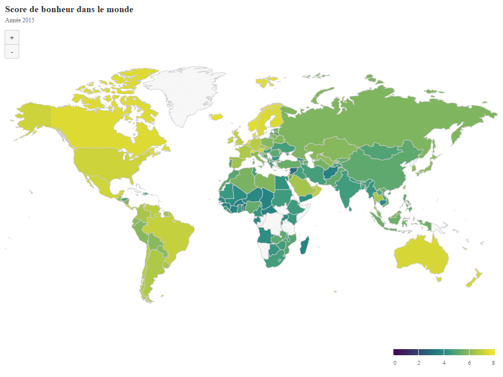
</center>

Nous pouvons voir grâce au Gif précédent que le *Score de bonheur* semble diminuer sur presque toute la planète au cours de cette période. Les pays les plus pauvres, déjà peu heureux semblent être les pays avec le plus fort déclin. Nous pouvons aussi remarquer une chute notable du *score de bonheur* en ***Amérique Latine***, en ***Afrique*** et en ***Asie***. La baisse du *score de bonheur* en ***Europe***, ***Amérique du Nord*** et en ***Océanie*** semble moins rapide, mais elle est néanmoins effective. 


### B.1) Scatterplot de 2015 à 2021 du *PIB* en fonction du *Score de corruption*

Dans un premier temps, nous souhaitons réaliser des visualisations répondant à la question : « Est-ce qu'habiter dans un pays corrompu signifie avoir un *PIB* bas ? "
Pour ce faire, nous réalisons un scatterplot des *PIB* en fonction du *Score de corruption* des pays présents dans chacun des datasets par année. Notons, les pays ayant un *Score de corruption* proche de 0 sont des pays perçue comme corrompu.


#### B.1.1) 2015

Nous allons faire, ici, une première visualisation sur l'année 2015. Pour ce faire, une fonction a été créée, celle-ci sera appliquée sur les datasets allant de 2015 à 2021.

```{r}
scatt_Corr_GDP<-function(param){
  #Création du scatterplot
  ggplot(param,aes(Corruption_Score,GDP_Score,label=Country)) +
  geom_point(aes(color=GDP_Score)) +
  #On met certain point en évidence
  geom_label_repel(aes(label=ifelse(Corruption_Score>0.40,as.character(Country),'')),hjust=1,vjust=1)+
  #Courbe 
  geom_smooth()+
  #Mettre un titre
  ggtitle(paste("Scatterplot du PIB en fonction\n du score de Corruption en",param$Year)) + 
  #Choisir un thème
  theme_wsj() + 
  theme(
    legend.position = "right",
    legend.key.size = unit(.5, "cm"),
    legend.direction = "vertical",
    legend.title = element_text(size = 10),
    title = element_text(size = 14),
    axis.title.y = element_text(size = 15),
    axis.title.x = element_text(size = 15)
  ) +
  #Nommer les abscisses et les ordonnées
  ylab("PIB")+
  xlab("Score de Corruption")+
  labs(color="PIB")}
```


```{r}
#Puis, nous appliquons la fonction précédemment crée sur les différents dataset allant de 2015 à 2021:
scatt_Corr_GDP(df2015)
```


La visualisation précédente montre que plus le *Score de corruption* est élevé, c'est-à-dire moins le pays est corrompu, moins le PIB a de chance d'être bas.
Cependant, ce n'est pas parce que le *Score de corruption* est faible que le *PIB* l'est aussi. Mais plus le *Score de corruption* est fort moins le pays a de chances d'avoir un PIB faible. D'ailleurs, cette observation se confirme avec l'allure de la geom_smooth().

Notons que ces résultats sont à prendre avec précautions ! En effet, pour le *Score de corruption*, il s'agit d'un score **ressenti**, de **perception**, i.e., les populations donnent leur ressenti sur la question de la corruption au sein de leur pays.

En 2015, par exemple, le pays avec le plus fort *Score de corruption* est le ***Rwanda***. Cela peut paraître surprenant, mais lors de cette année, il y eut un référendum très important visant à faire une réévaluation de la constitution. Celui-ci a entre autres, fait passer la durée du mandat du président de sept à cinq ans.

De plus, depuis 2015, le ***Rwanda*** mène une lutte acharnée à la corruption. Le ***Rwanda*** a été classé premier en ***Afrique de l'Est*** en matière de lutte anti-corruption dans le rapport de *Transparency International* en 2015.
***Singapour, le Danemark, la Suède, la Finlande, la Nouvelle-Zélande*** ont également de très hauts scores de corruption. Cette observation n'est pas étonnante, en effet, les causes de la corruption sont souvent politiques, et judiciaires. Le graphique met en évidence qu'elle est globalement plus faible dans les pays à régime démocratique.

En effet, la ***Suède***, le ***Danemark***, et la ***Nouvelle-Zélande*** sont des monarchie constitutionnelle, le roi n'a donc plus de pouvoirs. Ce sont est donc des démocraties parlementaires dans lesquelles le pouvoir émane du peuple. La ***Finlande***, quant à elle, est une république parlementaire. ***Singapour***, a un système républicain à régime parlementaire. Néanmoins, ***Singapour*** n'est pas totalement considéré comme une démocratie, pour différents points :

- L'état contrôle les médias,
- La peine de mort est légale,
- Les grèves ne sont pas autorisées.

Enfin, la ***Qatar*** fait exception à ce qui a été expliquée précédemment. En effet, la ***Qatar*** est une monarchie absolue où l'Emir est le chef de l'état et du gouvernement. La loi est basée sur la Charia. Ce *Score de corruption* si élevé peut ainsi s'expliquer par le niveau de vie très élevé au ***Qatar***. En effet, on remarque que plus un pays à un *PIB* élevé, plus il a de chance de ne pas être considéré comme corrompu par les populations. En effet, le revenu par habitant est de 50 000 euros par an. Ceci est dû aux ressources fossiles (Gaz naturel) et au tourisme qui font fonctionner l'économie du pays. Le ***Qatar*** est par ailleurs, le cinquième producteur de gaz naturel du monde après la ***Russie***, les ***États-Unis***, le ***Canada*** et l'***Iran*** ; il est devenu le premier exportateur de gaz naturel liquéfié.

Ainsi, il est important de rappeler que ces indicateurs sont à prendre avec précautions et du recul, afin d'avoir tous les éléments pour les interpréter au mieux. En effet, même si le ***Qatar*** n'est pas perçu par les populations comme corrompu, on ne peut pas en dire de même pour le reste du monde. En 2015, notamment, une polémique avait éclaté concernant des achats de votes pour le mondial de Handball.

Le code suivant permet de confirmer quel est le pays où le *Score de corruption* est le plus élevé, i.e., le pays le moins corrompu.

```{r}
Best_Corr_Score<-max(df2015$Corruption_Score)
#Fonction donnant le nom et le GDP Score du pays avec le corruption score le plus fort
Country <- c()
GDP_Score<-c()

# Parcours de tous les score de corruption en 2015
for (i in df2015$Corruption_Score) {
  if (i==Best_Corr_Score) {
     Country <- c(Country, df2015[df2015$Corruption_Score == i,]$Country)
      GDP_Score<- c(GDP_Score, df2015[df2015$Corruption_Score == i,]$GDP_Score)
  }
}

# Affichage des éléments
Country
GDP_Score
```


#### B.1.2) 2016

```{r}
scatt_Corr_GDP(df2016)
```

Ce graphique est très similaire à celui de 2015. En effet, dans l'ensemble plus le *Score de corruption* est haut, plus les pays ont des *PIB* élevés. Néanmoins, la réciproque n'est pas vraie. Ce n'est pas parce que le Pays a un haut *PIB* que le *Score de corruption* est haut !

De plus, le graphique en 2016 met aussi en évidence, le fait que la ***Suisse*** a un *Score de corruption* et *PIB* très élevé. Le revenu par habitant est d'environ 87 000 euros. De plus, la ***Suisse*** est un état démocratique, mêlant démocratie directe et représentative, et se caractérise par sa neutralité vis à vis des politiques étrangères.

#### B.1.3) 2017

```{r}
scatt_Corr_GDP(df2017)
```

Ce graphique donne des informations similaires aux graphiques précédents.
Ce scatterplot accentue le fait que plus le *Score de corruption* est élevé (c.a.d. moins de corruption) plus le pays a un fort *PIB*.

D'ailleurs, en 2017, c'est ***Singapour*** qui a un des meilleurs *Score de corruption* et *PIB*. En effet, dans la région de l’***Asie du Sud-Est***, où se situe ***Singapour***, la lutte anti-corruption est unique. En effet, cet état insulaire s'est développé économiquement très rapidement dans les années 1990. Ainsi, dans les années suivant son indépendance, la lutte contre la corruption a été très importante puisque cela permettait d'avoir un avantage concurrentiel de taille afin d’attirer les entreprises étrangères et de les pousser à investir dans le pays. C'est pourquoi en 2017 le *Score de corruption* qui est un score d'anti-corruption est aussi haut.


#### B.1.4) 2018
```{r}
scatt_Corr_GDP(df2018)
```


En 2018, nous avons décidé d'afficher les noms des pays avec des *PIB* très élevé. Il est ainsi aisé de remarquer que le *Score de corruption* du ***Qatar*** a drastiquement baissé. En effet, en 2018, il éclate une polémique concernant des soi-disant "Pot de vins" qui aurait été versée concernant l'attribution de certains votes pour le ***Qatar*** comme pays hôte de la coupe du monde 2022. Cette polémique pourrait donc expliquer la baisse du *Score de corruption*.

#### b.1.5) 2019
```{r}
scatt_Corr_GDP(df2019)
```


Ce graphique donne des informations similaires aux graphiques précédents.

#### B.1.6)2020

```{r}
scatt_Corr_GDP(df2020)
```


Ici, le PIB et le score de corruption sont calculés d'une manière différente ! C'est pourquoi, les données ont été traitées au préalable.
En 2020, le nombre de pays ayant un *Score de corruption* faible est plus important qu'en 2019. En effet, les quelques pays ayant un haut *Score de corruption* et un faible *PIB*, ont un *Score de corruption* qui a baissé (sauf pour le ***Rwanda*** qui reste constant).
L'année 2020 dresse un tableau sombre de l'état de la corruption dans le monde.
Plus de 3/4 des pays ont un score inférieur à 1. Ceci peut être expliqué par la crise sanitaire du covid qui a engendré énormément de mouvement *complotiste*, de théorie du complot autour de l'apparition du virus et de la manière de le traiter...

En revanche, on fait le même constat que précédemment, moins un pays est corrompu et plus le *PIB* est haut. La réciproque étant toujours fausse.

#### B.1.7) 2021
```{r}
scatt_Corr_GDP(df2021)
```

On peut ici, faire le même constat qu'en 2020.


### B.2) Scatterplot en 2015 en fonction des régions et pays du lien entre *PIB* et *Score de générosité*

Dans cette partie, sera tracé un scatterplot en 2015 du *Score de générosité* en fonction du *PIB* mettant en évidence les différentes régions du monde, ainsi qu'un GIF animé permettant d'observer l'évolution du scatterplot sur plusieurs années. Ainsi, nous tenterons de répondre grâce aux différentes visualisations aux questions suivantes : "Est-ce qu'un pays riche est généreux ?","Existe t-il une corrélation entre pays riches et pays généreux ?"," Est-ce qu'il existe un lien entre les différentes régions du monde et le *Score de générosité*, et le *PIB* ?".

#### B.2.1) 2015

Dans un premier temps, une fonction *generate_scatter_GDP_Generosity* est créée permettant par la suite de représenter facilement le scatterplot pour n'importe quelle année. Cette fonction sera notamment très utile pour la shinyApp. En effet, elle permettra à l'utilisateur de pouvoir tracer le graphe de manière totalement dynamique. Une fois, la fonction crée, nous l'utilisons afin de tracer le scatterplot pour l'année 2015.

```{r}
# Création d'une fonction pour générer un scatter plot de la Generosité en fonction du PIB
generate_scatter_GDP_Generosity <- function(df){
  
  # Filter selon les régions exsitantes
  df <- df %>% filter(!Region %in% c('NA'))
  
  # Création du plot
  p <- ggplot(df,aes(GDP_Score,Generosity_Score))+
  geom_point(aes(color=Region))+ theme_solarized_2() +
  ggtitle(paste('Score de Générosité en Fonction du PIB en', unique(df$Year))) +
  geom_label_repel(aes(label = ifelse(Generosity_Score>0.45 ,as.character(Country),'')),
                  box.padding   = 0.35, 
                  point.padding = 0.5,
                  segment.color = 'grey50')+
  xlab("PIB")+
  ylab("Score de Générosité")
  p
}
```


```{r}
generate_scatter_GDP_Generosity(df2015)
```

Ici, le scatterplot ne met pas en évidence une corrélation linéaire entre le *PIB* et le *Generosity_Score*. En revanche, on remarque de prime à bord que ce ne sont pas les pays les plus riches qui sont les plus généreux. En effet, les pays des régions :

- ***Europe de l'Ouest***,
- ***Amérique du nord et Océanie***.

jouissent de *PIB* très élevés, mais ne sont pas très généreux en comparaison à des pays avec des *PIB* beaucoup plus faible.

Par ailleurs, le graphique met en lumière que les pays ayant un *Score de générosité* élevé n'ont pas un haut *PIB* (PIB). En effet, les pays les plus généreux en 2015 se situent en :

- ***Asie du sud est***,
- ***Afrique subsaharienne***,
- ***Moyen Orient et Afrfique du nord***,
- ***Amérique latine et Caraïbes***,

Ce sont donc des régions du monde assez défavorisées. En effet, leur *PIB* est faible.

Ici, par exemple, le pays le plus généreux est ***Myanmar*** (Ex- Birmanie). C'est un pays de l'***Asie du Sud-est***.
Le **Myanmar** est un pays de contradictions. Son système de soins de santé est l'un des pires au monde. Il en va de même pour l'éducation. Mais une chose dont il ne manque pas, c'est la générosité. Malgré son statut de pays le moins avancé, il est le premier pays le plus généreux au monde.

De plus, rappelons que le *Score de générosité* n'est pas calculé en faisant la somme totale de l'argent donnée pour une cause ou une autre, mais l'acte de donner lui-même, sous la forme de trois comportements caritatifs spécifiques.

L'enquête mondiale Gallup s'est donc déroulée en demandant à des personnes de 145 pays les questions suivantes :

- "Au cours du mois dernier, avez-vous donné de l'argent à une organisation caritative ?",
- "Donner du temps à une organisation ?",
- "Aidé un étranger ou une personne que vous ne connaissiez pas et qui avait besoin d'aide ?"

Lorsque l'on fait la moyenne des résultats aux trois questions, le ***Myanmar*** arrive en tête.

En effet, ce pays est empreint par les traditions et l'influence du bouddhisme. Dans leur croyance, tous les bons actes faits, dans cette vie, auront des conséquences pour la prochaine vie et seront récompensés. Ainsi, plus une personne acquiert de mérite maintenant, plus elle augmente ses chances d'avoir une meilleure vie après.

Ce graphique peut ainsi laisser penser que la générosité est une valeur culturelle puisque pour certaines régions comme l'Afrique subsaharienne, le score de générosité semble assez uniforme. Nous tenterons de vérifier et de compléter cette observation par des *violin charts* dans la partie B.11.2).  


#### B.2.2)  Création de l'animation du scatterplot *PIB*/*Générosité* au fil des années

Ensuite, pour pouvoir observer l'évolution du *Score de générosité* en fonction du *PIB* une animation sur différentes années. Pour pouvoir obtenir des mouvements fluides, nous avons utilisé le package *gganimate*. Celui-ci permet d'interpoler les différentes dates intermédiaires entre chaque année.
Cette méthode est très efficace, mais comporte un détail non-négligeable. En effet, la dernière année n'apparaîtra pas sur la visualisation, car ce sont les dates intermédiaires qui seront affichées. L'animation représentera malgré tout la répartition des points pour cette date.

```{r, results='hide'}
#Création de l'animation au moyen de la librairie gganimate
scatter_GDP_Generosity_All <- # Creation des scatterplots
  ggplot(df_2015_to_2021,aes(GDP_Score,Generosity_Score))+
  geom_point(aes(color=Region))+ theme_solarized_2() +
  geom_label_repel(aes(label = ifelse(Generosity_Score>0.55 ,as.character(Country),'')),
                  box.padding   = 0.35, 
                  point.padding = 0.5,
                  segment.color = 'grey50') +
  
  # Ajout de la transition sur les dates
  transition_time(Year) +
  ggtitle(paste("Score de Générosité en Fonction du PIB en", "{frame_time}")) + 
  xlab("PIB")+
  ylab("Score de Générosité")+
  
  # Transition linéaire
  ease_aes("linear") +
  enter_fade() +
  exit_fade()

animate(scatter_GDP_Generosity_All, fps= 10, width= 720)
anim_save("img/scatterplot/animation_scatter_GDP_Generosity.gif")
```

<center>
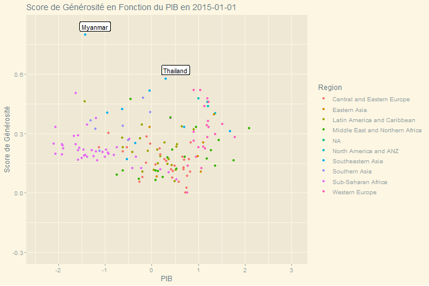
</center>

Le GIF permet d'observer une baisse significative générale à partir de 2019 du *Score de générosité*. L'explication derrière cette baisse est très certainement la crise sanitaire du covid. En effet, le monde a dû faire face à une pénurie des stocks de masques, à une pénurie du matériel médical, et du personnel médical, mais également à une longue attente et des stocks limités concernant les vaccins. Malgré cette baisse, il est toujours possible de remarquer que le ***Myanmar*** garde sa place de premier concernant le *PIB*.


Enfin, ce GIF montre que la richesse ne se traduit pas nécessairement par une plus grande générosité.

### B.3) Scatterplot et GIF animé sur plusieurs années en fonction des régions et pays du lien entre le *Bonheur* et la *Générosité*

Dans cette partie, sera tracé un scatterplot en 2015 du *Score de générosité* en fonction du *Score de générosité*, ainsi qu'un GIF animé permettant d'observer l'évolution du scatterplot sur plusieurs années. Ces visualisations permettront de répondre à la question : "Est-ce que le fait d'être généreux rend heureux et inversement ?"

#### B.3.1) 2015

Dans un premier temps, une fonction *generate_scatter_H_Generosity * est crée permettant par la suite de représenter facilement le scatterplot pour n'importe quelle année. Ici, elle sera appliquée sur l'année 2015. Cette fonction sera également très utile pour la shinyApp.  

```{r}
# Création d'une fonction pour générer un scatter plot entre le score de bonheur et la générosité
generate_scatter_H_Generosity <- function(df){
  
  # Filtrer selon les régions existantes
  df <- df %>% filter(!Region %in% c('NA'))
  
  # Création du plot
  p <- ggplot(df,aes(Happiness_Score,Generosity_Score))+
  geom_point(aes(color=Region))+ theme_solarized_2() +
  ggtitle(paste('Score de bonheur en Fonction de la Générosité en', unique(df$Year))) +
  geom_label_repel(aes(label = ifelse(Generosity_Score>0.45 ,as.character(Country),'')),
                  box.padding   = 0.35, 
                  point.padding = 0.5,
                  segment.color = 'grey50')+
  xlab("Score du Bonheur")+
  ylab("Score de Générosité")
  p
}

```


```{r}
generate_scatter_H_Generosity(df2015)
```

Le scatterplot précédent permet d'observer qu'il n'y a pas forcément de corrélation entre le *Score de bonheur* et le *Score de générosité*.
En effet, le ***Myanmar*** n'a pas un *Score de bonheur* élevé alors que c'est le pays le plus généreux en 2015. De même pour :

- ***l'Indonésie***,
- ***La Syrie***,
- ***Haiti***,
- ***La Somalie***,
- ***Bhutan***

En revanche la ***Thailande***, ***le Royaume-Uni*** et ***l'Irelande*** ont des *Score de bonheur* et *Score de générosité* élevés.

Le graphique permet d'observer globalement que :
- Les pays ***d'Afrique*** ne sont pas forcément moins généreux que les autres régions alors qu'ils sont très malheureux.
- Les pays ***d'Europe de l'ouest*** ont des *Score de bonheur* très élevés, mais ne sont pas forcément généreux,
- Les pays ***d'Asie du sud*** sont très généreux mais pas forcément heureux.

#### B.3.2) Création de l'animation du scatterplot *Bonheur/Générosité* au fil des années

Le but sera ensuite de créer une animation type GIF, celle-ci permettra d'étudier le scatterplot sur plusieurs années comme ci-après :
```{r, results='hide'}
#Création de l'animation au moyen de la librairie gganimate
scatter_H_Generosity_All <- ggplot(df_2015_to_2021,aes(Happiness_Score,Generosity_Score))+
  geom_point(aes(color=Region))+
  geom_label_repel(aes(label = ifelse(Happiness_Score>7 ,as.character(Country),'')),
                  box.padding   = 0.35, 
                  point.padding = 0.5,
                  segment.color = 'grey50') + theme_solarized_2() +
  
  # Ajout de la transition sur les dates
  transition_time(Year) +
  ggtitle(paste("Score de bonheur en Fonction de la Générosité en", "{frame_time}")) + 
  xlab("Score du Bonheur")+
  ylab("Score de Générosité")+
  
  # Transition linéaire
  ease_aes("linear") +
  enter_fade() +
  exit_fade()

animate(scatter_H_Generosity_All, fps= 10, width= 720)
anim_save("img/scatterplot/animation_scatter_Generosity_Happiness.gif")
```
<center>
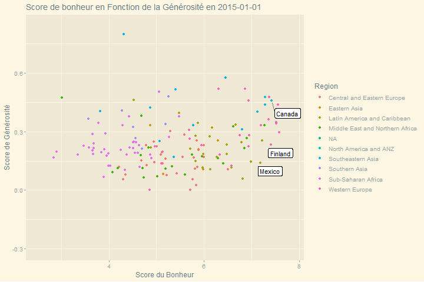
</center>
Tout comme le GIF, crée dans la partie B.2), on observe qu'il y a à partir de 2019 une grande baisse générale du *Score de générosité*. Ceci est sûrement dû à la crise sanitaire du covid. 


### B.4)Est ce que les Pays avec un gros un *PIB* sont les plus heureux?


Dans cette partie, sera tracé un scatterplot en 2015 du *Score de générosité* en fonction du *Score de bonheur*, ainsi qu'un GIF animé permettant d'observer l'évolution du scatterplot sur plusieurs années. Les visualisations permettront donc de répondre à la question : "Est-ce qu'un pays riche est forcément heureux ?"

#### B.4.1) 2015

Dans un premier temps, une fonction *generate_scatter_H_GDP* est créer permettant par la suite de représenter facilement le scatterplot pour n'importe quelle année. Ici, elle sera appliquée sur l'année 2015. Cette fonction sera également très utile pour la shinyApp. 
```{r}
generate_scatter_H_GDP <- function(df){
  df <- df %>% filter(!Region %in% c('NA'))
  p <- ggplot(df,aes(GDP_Score,Happiness_Score))+
  geom_point(aes(color=Region))+ theme_solarized_2() +
  geom_smooth() + 
  ggtitle(paste('Score de bonheur en Fonction du PIB en', unique(df$Year))) +
  geom_label_repel(aes(label = ifelse(GDP_Score>1.5 & Happiness_Score>6.5 ,as.character(Country),'')),
                  box.padding   = 0.35, 
                  point.padding = 0.5,
                  segment.color = 'grey50')+
  xlab("PIB")+
  ylab("Score du Bonheur")
  p
}
```

```{r}
generate_scatter_H_GDP(df2015)
```

Ce graphique montre une corrélation claire et nette des variables *PIB* et *Score de bonheur*. Cette corrélation linéaire est d'ailleurs accentuée par la geom_smooth().
Ainsi, plus le pays est riche et plus celui-ci a un *Score de bonheur* élevé. Les régions :

- ***Europe de l'Ouest***,
- ***Amérique du Nord et Océanie***,

sont donc très heureuse et riche contrairement à ***Afrique subsaharienne***.

#### B.4.2) Création de l'animation du scatterplot *PIB/Bonheur* au fil des années 

Le but sera ensuite de créer une animation type GIF, celle-ci permettra d'étudier le scatterplot sur plusieurs années.
```{r, results='hide'}
# filter les pays qui ont comme région NA
df_2015_to_2021 <- df_2015_to_2021 %>% filter(!Region %in% c('NA'))
  p <- ggplot(df_2015_to_2021,aes(GDP_Score,Happiness_Score))+
  geom_point(aes(color=Region))+
  geom_label_repel(aes(label = ifelse(GDP_Score>1.5 & Happiness_Score>6.5 ,as.character(Country),'')),
                  box.padding   = 0.35, 
                  point.padding = 0.5,
                  segment.color = 'grey50') + theme_solarized_2() +
    
  # transition sur le temps
  transition_time(Year) +
  ggtitle(paste("Score de bonheur en Fonction du PIB en", "{frame_time}")) + 
  xlab("PIB")+
  ylab("Score du Bonheur")+
    
  # transition linéaire  
  ease_aes("linear") +
  enter_fade() +
  exit_fade()

animate(p, fps= 10, width= 720)
anim_save("img/scatterplot/animation_scatter_GDP_Happiness.gif")
```

<center>
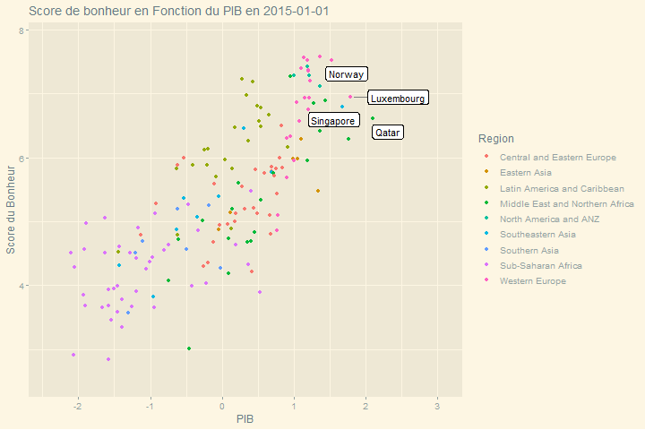
</center>

Le GIF nous permet de voir que globalement :
- Les pays d'***Europe de l'Ouest*** sont les plus riches et les plus heureux.
- Les pays d'***Afrique sub-saharienne*** sont les plus pauvres et les plus malheureux.
- Les pays d'***Asie du Sud*** ne sont pas très riches mais plutôt heureux.

En revanche, on remarque qu'il semble y avoir eu de grands changements en 2020 concernant le *PIB* de certains pays, notamment en ***Afrique sub-Saharienne***. En effet, de nombreuses baissent peuvent être observées, ceci est probablement dû à la crise du covid. Pour confirmer ou infirmer cette observation des *line charts* seront tracés ultérieurement. 

### B.5) Bubble plot représentant le *Score social* en fonction du *PIB*

#### B.5.1) Création de bubble Plot sur plusieurs années concernant la corrélation entre *Score social* et *PIB* en 2015

Le Gif animé de la partie B.4.2 a montré que le *Score de bonheur* était très corrélé aux *PIB*, i.e., plus un pays est riche et plus ses habitants sont heureux. Il est alors légitime de se demander s'il en va de même concernant le *Score social* et le *PIB*. Ainsi, nous pourrons vérifier ce questionnement au moyen d'un *bubble Chart*, qui ajoutera une variable supplémentaire, ici le *Score de bonheur* en fonction de la taille des bulles. Ainsi, plus une bulle est grande, plus le *Score de bonheur* est élevé.

Rappelons que le *Score social* mesure notre entourage, c'est-à-dire le nombre d'amis, le nombre de membres dans la famille, les personnes proches, celles qui nous entourent au quotidien.


```{r}
generate_bubblescat_Social_GDP <- function(df){
  #Suppression des NA
  df <- df %>% filter(!Region %in% c('NA'))
  
  # Génération d'un plotly
  p <- df %>%
      ggplot(aes(x=GDP_Score, y=Social_Score, size=1.8**Happiness_Score, color=Region,text = paste("country:",Country))) +
      labs(title=paste0('Score de Social en Fonction du PIB en', df$Year))+
      geom_point(alpha=0.5) +
    
      # Changement de la taille des points en fonction du score de Bonheur
      scale_size(range = c(.00001, 4),name="Score de Bonheur")+ theme_solarized_2() +
      theme(plot.title=element_text(size=10))+
      ylab("Score Social")+
      xlab("PIB")
    

p
}
```

<center>
```{r}
generate_bubblescat_Social_GDP(df2015)
```
</center>

Ce scatterplot montre que le :

- *Score de bonheur*,
- *PIB*,
- *Score social*

sont très corrélés. En effet, plus un pays a un PIB élevé et plus son *Score social* et *Score de bonheur* sont élevés.
C'est notamment le cas pour les régions :

- ***Europe de l'Ouest***,
- ***Amérique du Nord et Océanie***

Néanmoins, notons que la pente de la droite de régression n'est pas aussi forte que celle entre le *Score de bonheur* et le *PIB*.

#### B.5.2) Création de l'animation du scatterplot *Score social/PIB* au fil des années
Cette animation permettra d'observer les corrélations sur plusieurs années de manière plus simple et agréable.
```{r, results='hide'}
# même fonction que précédemment pour animer le bubble plot avec gganimate
scatter_GDP_Happiness_All <- ggplot(df_2015_to_2021,aes(GDP_Score,Social_Score,size=1.8**Happiness_Score, color=Region,text = paste("country:",Country)))+
  geom_point(aes(color=Region),alpha=0.5)+
  scale_size(range = c(.001, 4),name="Score de bonheur") + theme_solarized_2() +
  transition_time(Year) +
  ggtitle(paste("Score de Social en Fonction du PIB en", "{frame_time}")) + 
  ylab("Score Social")+
  xlab("PIB")+
  ease_aes("linear") +
  enter_fade() +
  exit_fade()

animate(scatter_GDP_Happiness_All, fps= 10, width= 720)
anim_save("img/scatterplot/animation_scatter_GDP_Social.gif")
```

<center>
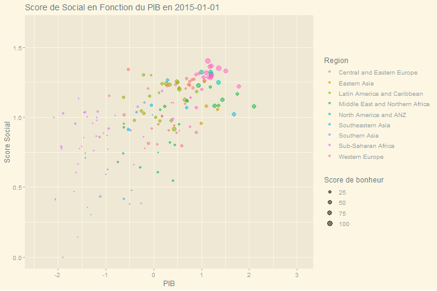
</center>

Le GIF permet d'observer une baisse significative du *Score social* en 2019 et que celle-ci stagne en 2020. Ceci peut certainement s'expliquer par la crise du covid. En effet, lors de cette crise, beaucoup de personnes se sont renfermées et ont réduit leur entourage. De plus, durant cette crise, des millions de personnes sont mortes, ce qui pourrait également expliquer la baisse générale du *Score social*.


### B.5.3) Création de bubble Plot sur plusieurs années concernant la corrélation entre *Espérance de vie*, *PIB* et *Bonheur* en 2015

Enfin, il paraît pertinent d'étudier conjointement les comportements du *Score d'espérance de vie*, *PIB*, et *Score de bonheur*. Nous devrions observer une forte corrélation entre ces trois variables. En effet, plus le *PIB* est haut, et plus l'état peut aider les populations à se soigner et ainsi l'espérance de vie devrait évoluer de la même manière, de même pour le *Score de bonheur*.

```{r}
generate_bubblescat_Social_GDP <- function(df){
  # Suppression des NA
  df <- df %>% filter(!Region %in% c('NA'))
  p <- df %>%
      
      # Changempent de la taille des points en fonction du score de bonheur
      ggplot(aes(x=GDP_Score, y=Social_Score, size=1.8**Happiness_Score, color=Region,text = paste("country:",Country))) +
      labs(title=paste0('Score de Social en Fonction du PIB en ', df$Year))+
      geom_point(alpha=0.5) +
    
      # Changement de la taille pour un intervalle plus lisible
      scale_size(range = c(.001, 4),name="Score de Bonheur")+ theme_solarized_2() +
      theme(plot.title=element_text(size=10))+
      ylab("Score Social")+
      xlab("PIB")
    
  p
}

```

```{r}
generate_bubblescat_Social_GDP(df2015)
```

Le graphique ci-dessus met en évidence une corrélation linéaire entre le *PIB* et le *Espérance de vie*. De plus, cette corrélation est aussi liée au *Score de bonheur*. En effet, plus un pays est riche, plus son espérance de vie est haute et plus la population du pays est heureuse.
Ainsi, les pays d'***Europe de l'Ouest*** et d'***Amérique du Nord***, ainsi que l'***Australie*** et la ***Nouvelle-Zélande***, font partie des régions où il fait bon vivre.

Cependant, notons que cette corrélation est évidente d'un point de vue monde, mais en est-il de même en changeant d'échelle ? Est-ce que cette corrélation est toujours vraie au sein du ***continent africain*** ? Nous répondrons ultérieurement à cette question dans la partie B.10, au moyen d'une *Treemap*. 

#### B.5.4) Création de l'animation du scatterplot *PIB /Espérance de vie moyenne* au fil des années

Cette animation permettra d'observer les corrélations sur plusieurs années de manière plus simple et agréable.
```{r, results='hide'}
scatter_GDP_Life_Expectancy_All <- ggplot(df_2015_to_2021,aes(GDP_Score,Life_Expectancy_Score,size=1.8**Happiness_Score, color=Region,text = paste("country:",Country)))+
  geom_point(aes(color=Region),alpha=0.5)+ theme_solarized_2() +
  scale_size(range = c(.001, 4),name="Score de bonheur")+
  transition_time(Year) +
  ggtitle(paste("Espérance de vie en Fonction du PIB en", "{frame_time}")) +
  xlab("PIB")+
  ylab("Score d'Esperance de vie")+
  ease_aes("linear") +
  enter_fade() +
  exit_fade()

animate(scatter_GDP_Life_Expectancy_All, fps= 10, width= 720)
anim_save("img/scatterplot/animation_scatter_GDP_Life.gif")
```
<center>
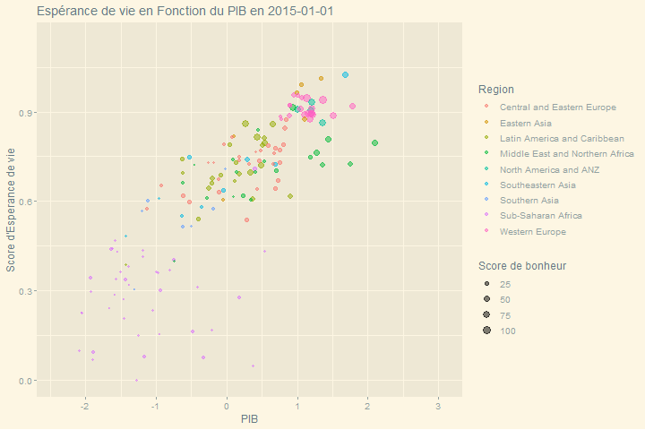
</center>

Ces graphiques montrent de manière évidente une corrélation linéaire entre *Espérance de vie* et le *PIB*.

Ce résultat est loin d'être surprenant. En effet, plus un pays est riche et plus il a les moyens de subvenir aux soins nécessaires de santé pour ces populations qui ont ainsi une moyenne de vie plus élevée.

En revanche, on remarque qu'il y a une grande baisse de l'espérance de vie moyenne en 2019 et 2020, celle-ci est très certainement liée aux nombreux morts du covid.


### B.6) Bilan des corrélations linéaires entre variables 

Nous avons donc étudié au travers des parties précédentes plusieurs scatterplot, i.e., les liens entre différentes variables du dataset. Certaines corrélations étaient linéaires, d'autres pas. Pour résumer, les corrélations linéaires, nous avons donc créé deux *corplot*, ci-après :

```{r}
# utilisation de la fonction corrplot pour générer une matrice de corrélation linéaire entre nos variables
corrplot(cor(df2015[,c('GDP_Score', 'Life_Expectancy_Score', 'Happiness_Score', 'Social_Score', 'Generosity_Score', 'Freedom_Score', 'Corruption_Score')]), type = 'lower', order = 'hclust', tl.col = 'black',
         cl.ratio = 0.2, tl.srt = 45, col = COL2('RdBu', 10),title="Matrice des corrélations linéaires entre variables", mar=c(0,0,1,0))
```

```{r}
# utilisation du package highcharts pour générer une matrice de corrélation linéaire dynamique entre nos variables
hchart(cor(df2015[,c('GDP_Score', 'Life_Expectancy_Score', 'Happiness_Score', 'Social_Score', 'Generosity_Score', 'Freedom_Score', 'Corruption_Score')]))
```

Ce graphe de corrélation met en évidence la corrélation linéaire entre le *Score de bonheur*, le *PIB*, le *Espérance de vie*, le *Score social*. Ainsi, plus le Pays est riche, plus ces habitants ont une grande espérance de vie, plus ils ont un entourage conséquent et plus ils sont heureux.

Rappelons qu'ici, ce sont des corrélations linéaires dont il s'agit. Pour en savoir plus sur les variables, les régions et les pays, nous allons donc effectuer d'autres visualisations.

De plus, on remarque que le *Score de liberté* et le *Score de corruption* sont très corrélés. Puisque ces deux indicateurs sont très similaires en sens et sont très corrélés, nous n'étudierons que le *Score de corruption*.


Ainsi, nous avons fait le choix de porter notre étude dans les prochaines parties sur le *Score de bonheur* par le biais de différentes visualisations entre les régions et entre les pays. Le but sera ainsi de répondre aux questions : " Comment est réparti le *Score de bonheur* dans le monde, entre les régions, et entre les pays et comment évolue-t-il ?"


### B.7) Barplot type 1

#### B.7.1) Barplot donnant la mediane du *Score de bonheur* au sein des régions en 2015

Dans cette partie, nous tenterons d'avoir des premières idées, informations concernant le *Score de bonheur* entre les différentes régions du monde. C'est pourquoi, nous étudierons, ici, un *barplot* donnant la médiane du score du bonheur entre les régions afin de pouvoir les comparer entre elles.

```{r}
# Création d'une fonction de création de bar chart généralisable à plusieurs années
bar_chart_region_happiness_score_median <- function(dfyear){
  
  # Filtrer sur les valeurs différentes de NA
  df <- dfyear %>% filter(!Region %in% c('NA'))
  
  # Générer un autre dataframe pour obtenir la médiane du score de bonheur par région
  df <- df %>% group_by(Region) %>% summarise_at(vars(Happiness_Score), list(Happiness_score = median))
  
  # Création du bar chart
  p <- df %>% ggplot(aes(x=Region, y=Happiness_score)) +
    geom_bar(stat="identity", fill="steelblue",width=0.4) +
    theme_solarized_2() + coord_flip()+ylab("Score du Bonheur")+xlab("Région")+ 
    ggtitle(paste0('Mediane par Région du Happiness Score en ', dfyear$Year))+
    
    # Ajout de la ligne médiane du score de bonheur entre toutes les régions
    geom_hline(yintercept = median(df$Happiness_score), linetype = "dashed", color='red')
  
  p
}
bar_chart_region_happiness_score_median(df2015)
```

En observant cette visualisation, nous pouvons dans un premier temps remarquer que 2 régions se démarquent des autres de par leur supériorité médiane de Score de Bonheur. En effet, la région ***Europe de l'Ouest*** et ***Amérique du nord*** et ***Australie et Nouvelle Zélande*** ont un médian bien supérieur aux autres régions.

Nous pouvions s'attendre à cette différence, car nous avons pu remarquer que parmi les variables les plus corrélées positivement avec le *score de bonheur* se trouvent :

- *PIB*
- *Espérance de vie*

Or, ces deux régions sont les deux régions du monde les plus développées.

Il est aussi assez aisé d'observer que les régions ayant le moins grand score de bonheur médian sont les régions ***d'Afrique Sub-Saharienne*** et ***d'Asie du Sud***.

Cette répartition de score de bonheur selon les régions peut s'expliquer par différents facteurs comme par exemple *l'éspérance de vie*, mais surtout, car ces régions sont depuis longtemps des **zones de conflits**.

Enfin, nous pouvons dire que le profil médian de toutes ces régions du monde est celui de l'***Asie du Sud-Est***. En effet, son score de bonheur arrive au niveau exact de la médiane du score de bonheur.

L'évolution de ce score au fil du temps peut être analysée avec le graphique suivant.

#### B.8.2) Animation des barplot sur plusieurs années 

Cette animation permettra d'observer les corrélations sur plusieurs années de manière plus simple et agréable.
```{r}
# Générer un dataframe en groupant par région et par année en filtrant les régions différentes de NA. On obtient la médiane du score de bonheur pour chaque région et année.
df_group_Region_Year <- df_2015_to_2021 %>% filter(!Region %in% 'NA') %>% group_by(Region, Year) %>%  summarise_at(vars(Happiness_Score), list(Happiness_score = median))

# Création d'un barchart animé sur les régions au fil du temps
Bar_Happiness_All <- df_group_Region_Year %>% ggplot(aes(x=Region, y=Happiness_score)) +
    geom_bar(stat="identity", fill="steelblue",width=0.4, repel=TRUE) +
    theme_minimal() + coord_flip() + theme_solarized_2() + 
    theme(
      title = element_text(size = 15),
      axis.title.x = element_text(size = 14),
      axis.title.y = element_text(size = 14),
      axis.text.x = element_text(size = 12)
    ) +
  
    # Transition sur chaque année
    transition_time(Year) +
    ggtitle(paste("Mediane par Région du Happiness Score en", "{frame_time}")) + 
    ylab("Score du Bbonheur")+
    xlab("Région") +
    geom_hline(yintercept = median(df_group_Region_Year$Happiness_score), linetype = "dashed", color='red') +
  
    # Transition linéaire
    ease_aes("linear") +
    enter_fade() +
    exit_fade()

#animate(Bar_Happiness_All, fps= 10, width= 720)
#anim_save("img/scatterplot/animation_Bar_Happiness_All.gif")
```

<center>
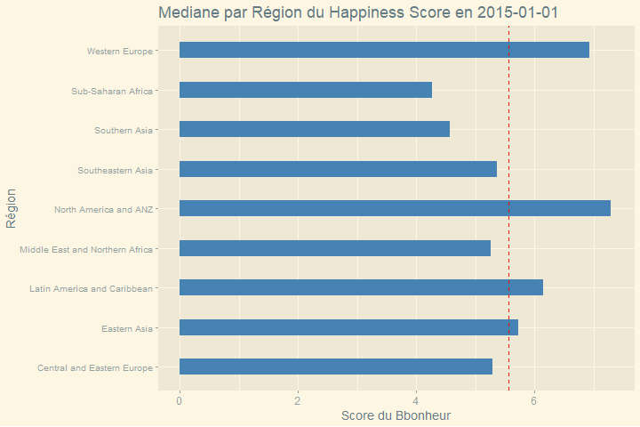
</center>


On peut remarquer sur ce graphique que la médiane du *Score de bonheur* ne varie pas énormément pour les deux régions ayant un score très élevé.

Ce n'est en revanche pas le cas pour d'autres régions où la situation est beaucoup moins stable comme l'***Afrique du nord*** et le ***Moyen Orient*** qui a vu son score baisser drastiquement à partir de l'année **2018** jusqu'à nos jours. En effet, en plus de la situation très peu stable des pays de ces régions, l'ont a pu observer en 2018 de multiples censures de la liberté d'expression, de conflit armé et d'impact sur les droits humains (Plus d'informations via ce [lien] (https://www.amnesty.org/fr/latest/research/2019/02/human-rights-in-the-middle-east-and-north-africa-2018/)).

A contrario, ***l'Asie du sud-est*** a jusqu'en 2017 baisser en niveau de bonheur pour connaître à la suite une croissance lui permettant de dépasser le score de l'***Afrique du nord*** et du ***Moyen Orient***.

Pour mieux observer la répartition des scores de bonheur des pays au sein même des régions, nous pouvons tracer un histogramme groupant les pays entre régions identiques. C'est pourquoi dans la partie suivante, nous créerons un *RoudBar Chart*.

### B.9) RoundBar

#### B.9.1) Roundbar chart donnant le Happiness Score au sein des régions en 2015

Dans cette partie, nous réalisons donc un *roundbar*, celui-ci permettra comme expliqué précédemment d'observer de manière plus précise la répartition des scores du bonheur des pays au sein d'une même région.

```{r, results='hide'}
# Création d'un fonction permettant de générer un barplot rond
round_bar_plot_country <- function(dfyear){

  # On filtre sur chaque régions différentes de NA
  df <- dfyear %>% filter(!Region %in% c('NA'))
  
  # On organise de manière aléatoire les différents pays
  df <- df[sample(1:nrow(df)), ]

  # Ajout d'un numéro pour chaque éléments
  number_bar <- nrow(df)
  
  # Ajout de 8 barres vides entre chaque groupe de régions
  empty_bar <- 8
  to_add <- data.frame(matrix(NA, empty_bar*length(unique(df$Region)), ncol(df)))
  colnames(to_add) <- colnames(df)
  to_add$Region <- rep(unique(df$Region), each=empty_bar)

  data <- rbind(df, to_add)
  data <- data[order(data$Region, decreasing=TRUE),]
  data$id <- seq(1, nrow(data))
  
  # Changement du nom des différentes régions à afficher sur le graphique par leurs initiales
  data$subRegion <- gsub('\\b(\\pL)\\pL{2,}|.','\\U\\1',data$Region,perl = TRUE)

  # Préparation du dataframe pour ajouter des lignes en dessous de chaque régions
  base_data <- data %>%
    group_by(Region) %>%
    summarize(start=min(id), end=max(id) - empty_bar, subRegion=subRegion) %>%
    rowwise() %>%
    mutate(title=mean(c(start, end)))
 
  # Génération du plot
  p <- ggplot(data, aes(x=as.factor(id), y=1.8**Happiness_Score, fill=Region)) +         
    # Création d'un barplot
    geom_bar(aes(x=as.factor(id), y=1.8**Happiness_Score, fill=Region), stat="identity",alpha=.7) +

    theme_minimal() + ggtitle(paste("Barplot circulaire de l'Happiness Score en", unique(dfyear$Year)), subtitle = "Note : Les unités ne sont pas à la bonne échelle, ne peut être utilisé qu'à des fins de visualisation")+
      
    # Changement du thème pour bien afficher les différents éléments sur le graphique
    theme(
      legend.position = "right",
      legend.key.size = unit(2.3, 'cm'), #change legend key size
      legend.key.height = unit(2.3, 'cm'), #change legend key height
      legend.key.width = unit(2.3, 'cm'), #change legend key width
      legend.title = element_text(size=25), #change legend title font size
      legend.text = element_text(size=20),
      axis.text = element_blank(),
      axis.title = element_blank(),
      panel.grid = element_blank(),
      plot.title = element_text(size = 50),
      plot.subtitle = element_text(size = 20),
      plot.margin = margin(0, -1, -1, -1, "cm") 
    ) +
    
    # Changement de l'intervalle pour bien afficher les barres
    ylim(-100, 90) +
    
    # Changement de l'affichage en polaire pour générer un barplot circulaire
    coord_polar(start = 0) +
    
    # Ajout des segments en dessous de chaque régions
    geom_segment(data=base_data, aes(x = start, y = -4, xend = end, yend = -4), colour = "black", alpha=0.8, size=0.6 )  +
    
    # Ajout des textes pour chaque régions
    geom_text(data=base_data, aes(x = title, y = -20, label=subRegion), colour = "black", alpha=0.8, size=7)

  p

}
for (df in list_df){
  png(file=paste0("img/roundbar/", df$Year, ".png"), width=2160, height=1440)
  print(round_bar_plot_country(df))
  dev.off()
}

frames <- paste0("img/roundbar/", 2015:2021, ".png")
m <-image_read(frames)
m <- image_animate(m, delay = 30)
image_write(m, "img/roundbar/animation_roundbar.gif")

```
<center>

</center>

Afin de mieux visualiser les disparités qui peuvent exister entre les pays au sein d'une même région, nous avons pu tracer un *barplot circulaire* en fonction du score de bonheur pour chacun des pays.

La taille des barres de ce graphique n'est cependant pas à l'échelle et a été modifiée. En effet, pour accentuer les différences, le score a été modifié par cette formule : $score_{roundbar} = 1.8^{score}$.

On peut assez aisément observer que les pays se trouvant au sein de ***l'Amérique du nord*** / ***Océanie*** ont un score de bonheur bien plus élevé qu'en ***Afrique subsaharienne***. La répartition de ce score est, en effet, assez homogène au sein des deux régions.

La répartition est en revanche très hétérogène en ***Europe de l'Ouest*** où se trouvent les pays les *"plus heureux"* du monde. On observe ainsi que certains pays de cette région ont un score de bonheur non loin de l'***Afrique Subsaharienne*** qui est la région la *"moins heureuse"*.

Une différence que nous pouvons noter avec l'analyse du graphique précédent est la présence de certains pays dont le score de bonheur est assez élevé bien que se trouvant dans une région en dessous de la médiane mondiale. On peut donc observer que cette région est très hétérogène contrairement à l'***Afrique Subsaharienne***.

Enfin, ce *roundbar* met en évidence que la région subsaharienne bien que contenant le plus de pays de notre jeu de données, contient presque tous les pays les *"moins heureux"* du monde.
 
#### B.9.2) Evolution du score de bonheur au sein des régions à partir de 2015

Cette animation permettra d'observer les corrélations sur plusieurs années de manière plus simple et agréable.

<center>
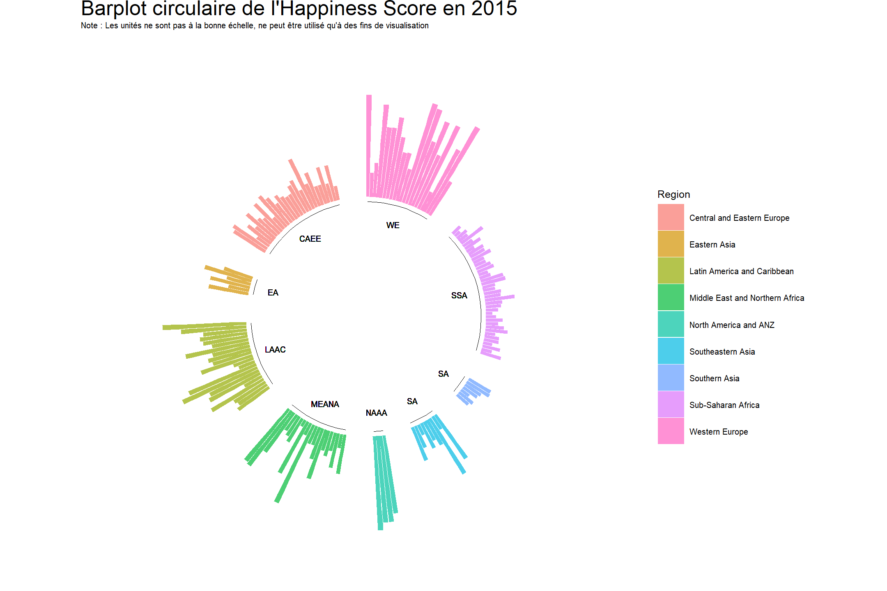
</center>

Cette animation, nous permet de remarquer qu'au cours du temps, les différences générales entre les régions ne varient pas énormément. Ainsi, l'***Afrique subsaharienne*** reste toujours en dernière place avec les valeurs de score les plus petites et les deux régions ***Europe de l'Ouest*** et ***Amérique du nord***/***Australie et Nouvelle Zélande*** qui ont les scores les plus élevés.

En revanche, il faut savoir que sur ce graphique, les pays sont toujours ordonnés de la même manière au sein de leurs régions respectives. Ainsi, nous pouvons comparer les différentes variations qui subviennent au cours des années. Les variations au sein de la région ***Moyen Orient*** et ***Afrique du nord*** sont assez marquées. Celles-ci peuvent être expliquées par les différents conflits et l'instabilité des pays de cette région du monde concernant le ***Moyen Orient***.

Il n'est cependant pas aisé de voir comment sont répartis les différents scores de bonheur sur cette visualisation. Essayons une autre manière d'observer cette répartition.


### B.10) Ridge Plot

### B.10.1) Ridge Plot donnant la répartition du *Score de bonheur* en 2015

Après s'être interrogé sur les différents liens entre les variables, on peut, se demander quelle est la répartition du *Score de bonheur* par exemple au sein de chaque région sur différentes années. Pour ce faire, nous avons tracé un *ridge plot* en 2015 :

```{r}
# Création d'une fonction pour générer des ridges lines généralisables à chaque régions
ridge_line_region <- function(dfyear){
  
  # Filtrage sur chaque région différentes de NA
  dfyear <- dfyear %>% filter(!Region %in% c('NA'))
  
  # Génération d'un ggplot
  ggplot(dfyear, aes(x = Happiness_Score, y = Region, fill = ..x..)) +
    
    # Transformer le ggplot en density ridges gradient
    geom_density_ridges_gradient(scale = 2, rel_min_height = 0.01) +
    
    # Changement du theme pour le choix des couleurs
    scale_fill_viridis(name = "Score du Bonheur", option = "B") +
    ggtitle(paste('Repartition du score de bonheur en', unique(dfyear$Year))) + theme_wsj() +
    theme(
      legend.position="bottom",
      strip.text.x = element_text(size = 3), 
      legend.key.height = unit(.2, 'cm'), 
      legend.key.width = unit(1, 'cm'),
    )+ xlab("Score du Bonheur") 
}
```

```{r results='hide'}
# Enregistrement du graphique au format PNG pour obtenir un meilleur affichage
png("img/Ridge/repartition_2015.png", width = 1080, height = 720)
ridge_line_region(df2015)
dev.off()
```
<center>
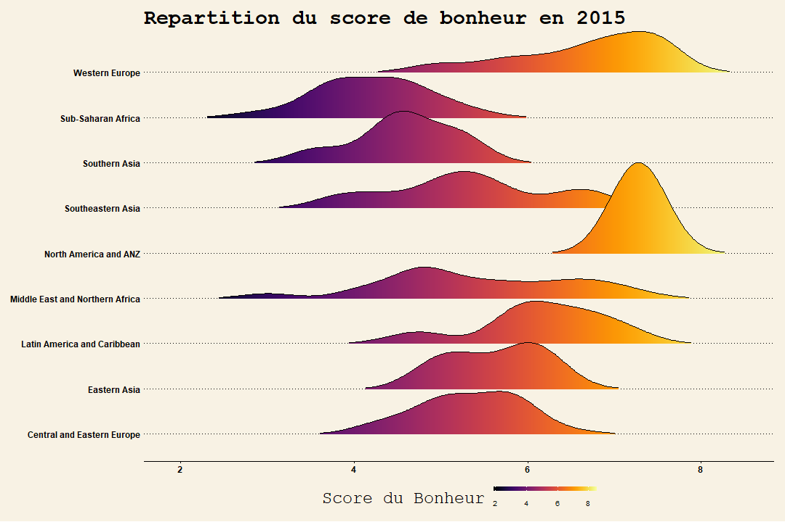
</center>

Sur cette visualisation, nous pouvons parfaitement observer la répartition des scores de bonheur entre les pays au sein d'une même région.

Ainsi, nous remarquons que la région ***Moyen Orient*** et ***Afrique du Nord*** possède le profil le plus hétérogène parmi toutes les régions présentées. En effet, le minimum se trouve presque au plus bas au niveau mondial et son maximum dépasse la moyenne des régions ***Amérique du Nord*** et ***Australie/Nouvelle Zélande*** et ***Europe de l'Ouest***. On retrouve cependant la plus grande densité aux alentours de 5 sur l'échelle du score de bonheur, ce qui est en dessous de la moyenne mondiale.

Comme nous pouvions le voir sur les graphiques précédents, l'***Afrique Subsaharienne*** est assez homogène et on trouve une grande partie des pays autour de 4 sur l'échelle du bonheur.

L'***Europe de l'Ouest*** quant à elle bien qu'assez étalée, trouve sa moyenne/sa plus grande densité de pays au même niveau que pour la région des ***Etats Unis***.

On remarque d'ailleurs que la région ***Amérique du Nord*** et ***Australie/Nouvelle Zélande*** est très peu répartie. Cela est dû au nombre très faible de pays dans cette région ($n_{pays} = 4$).

```{r, results='hide'}
# Création du dataframe sur les régions groupées par années avec le score de bonheur correspondant
df_group_Region_Year <- df_2015_to_2021 %>% group_by(Region, Year) 
    Ridge_Happiness_All <- df_group_Region_Year %>% ggplot( aes(x = Happiness_Score, y =       Region, fill = ..x..)) +
      
    # Création d'un density ridge
    geom_density_ridges_gradient(scale = 2, rel_min_height = 0.01) +
    scale_fill_viridis(name = "Score de bonheur", option = "B") +
    labs(title = paste('Repartition du score de bonheur en', unique(df_group_Region_Year$Year))) + theme_wsj() +
      
      # Changement du theme
    theme(
      legend.position="bottom",
      panel.spacing = unit(0.1, "lines"),
      strip.text.x = element_text(size = 19),
      title = element_text(size = 20),
      legend.text = element_text(size = 10),
      legend.key.size = unit(2.3, 'cm'), #change legend key size
      legend.key.height = unit(.5, 'cm'), #change legend key height
      legend.key.width = unit(2.3, 'cm'),
      axis.text.y = element_text(face="bold", size = 14)
      
    )+ xlab("Score du Bonheur") +
      
    # Transition sur l'année
    transition_time(Year) +
    ggtitle(paste("Répartition du Happiness_Score par région en", "{frame_time}")) + 
    
    # Transition linéaire
    ease_aes("linear") +
    enter_fade() +
    exit_fade()

animate(Ridge_Happiness_All, fps= 10, width= 1080, height = 720)
anim_save("img/Ridge/animation_Ridge_Happiness_All.gif")
```


#### B.10.2) Evolution de la répartition du score de bonheur au cours du temps

Cette animation permettra d'observer les corrélations sur plusieurs années de manière plus simple et agréable.

<center>

</center>
Sur cette visualisation, nous arrivons très bien à observer l'évolution de la répartition des *scores de bonheurs* des différentes régions.

L'***Asie du Sud-est*** voit ainsi une partie de ses pays baisser drastiquement en *bonheur* à partir de 2019-2020 et s'éloigner du groupe majoritaire. Cela est certainement dû au Covid, car la population y a connu des confinement très restrictifs pendant de longs moments, empêchant ainsi les *liens sociaux* ainsi que la *liberté*, qui sont toutes deux très corrélées au *score de bonheur*.


Il est aussi possible de voir que l'***Asie du Sud-est*** voit son homogénéité croître. Les *Scores de bonheurs* des différents pays se rapprochent de plus en plus en avançant dans le temps.

Les régions ***Européennes*** et ***Amérique du nord***/ ***Australie et Nouvelle-Zélande*** ne connaissent en revanche pas de grands changements au niveau de la répartition des scores de bonheur.


### B.11) Treemap

#### B.11.1) Repartition de l'*Espérance de vie* en ***Afrique Subsaharrienne*** au moyen d'un treemap en 2015


L'*espérance de vie* est une donnée très importante, puisque celle-ci est révélatrice de nombreux problèmes dans un pays. Ainsi, il nous paraissait important d'étudier ce paramètre notamment en ce qui concerne le continent africain. Nous savons en effet, qu'il y existe de nombreuses disparités entre les différents pays, mais également au sein même des pays.

C'est pourquoi nous avons voulu répondre dans un premier à la question :"Y a-t-il des disparités au niveau de l'espérance de vie entre pays d’Afrique ?" et "Comment est répartie l'espérance de vie en ***Afrique*** ?". Nous chercherons également à répondre à la question soulevée dans la partie B.5.2). En effet, nous nous demandions si la corrélation entre le *PIB* et le *Espérance de vie* était vrai au sein des régions notamment en ***Afrique***.

Pour ce faire, nous avons utilisé une *Treemap*. Ce type de visualisation permet d'avoir une vue d'ensemble, une première vision des choses.
Comme précédemment, nous détaillerons les observations pouvant être faite sur l'année 2015. Puis, un GIF sera créé afin de pouvoir étudier de manière générale la répartition du *Score d'espérance de vie* en ***Afrique sub-saharienne***.
 

```{r}
#Création d'une fonction via le package hchart permettant de générer plusieurs treemap sur différentes années
Treemap_plot_country<-function(df){
  
  #Selection des colonnes concernées
  data<-select(df,c("Region","Country","Life_Expectancy_Score","GDP_Score","Year"))
  #Filtrer le dataset sur la région voulu
  data<-data  %>% filter(Region=="Sub-Saharan Africa")
  #Création du hchart
  data %>%
    hchart(
      "treemap", 
      hcaes(x = "Country", value = "Life_Expectancy_Score", color = "GDP_Score")
      , name = "PIB")%>% 
  hc_colorAxis(stops = color_stops(colors = viridis::inferno(10))) %>%hc_title(text=paste("Répartition du Score d'éspérance de Vie en Afrique Sub-Saharienne en ",unique(df$Year), "\n Colorié en fonction du PIB" ))
  

}
```
<center>
```{r}
#Application de la fonction "Treemap_plot_country" sur l'année 2015
Treemap_plot_country(df2015)
```
</center>

Cette *Treemap* révèle de nombreuses disparités en ***Afrique***. En effet, l'espérance de vie est très différente entre les pays. Nous remarquons tout d'abord que le pays avec la plus grande espérance de vie est la ***Mauritanie***. Ce pays, se trouvant au sud du Maroc, est une ancienne colonie française ayant obtenu son indépendance en 1960. Son espérance de vie peut s'expliquer en raison de son haut PIB. En effet, son *Score de PIB* est à 0,40 là où la plupart des autres pays d'Afrique ont des *Score de PIB* négatifs. La ***Mauritanie*** tient sa richesse de la pêche, l'agriculture et l'élevage. D'ailleurs, en 2015, l'***UE*** met en place un nouveau partenariat avec la ***Mauritanie*** permettant d'appliquer des protocoles de pêches durables et fait don de 4 millions d'euro pour les communauté locales vivant de la pêche. En effet, les côtes mauritaniennes sont parmi les plus poissonneuses au monde.

Enfin, la *Treemap* met en lumière le fait que la corrélation entre le *PIB* et *l'Espérance de vie* n'est pas nette en ***Afrique sub-saharienne***. En effet, ***l'Afrique du Sud*** et ***Botswana*** font partie des pays les plus riches d'Afrique et pourtant, l'espérance de vie y est très faible. Ces deux pays en plus de partagées des frontières, sont liés économiquement. Leurs économies se composent en des services et des mines, avec une très faible part d'industries et d'agriculture. Par ailleurs, le ***Botswana*** est un des pays les moins corrompu d'Afrique. En effet, le régime politique est une république mêlant le régime présidentiel et démocratie représentative. Mais alors pourquoi l'espérance de vie y est si faible ? Cela s'explique par un nombre important de la population touché par le VIH. Celui-ci est une véritable épidémie pour le pays. Le virus touche toutes les tranches d'Age. En effet, les Botswanais ont été victimes de leur manque d'éducation sexuelle.


#### B.11.2) Evolution de l'*Espérance de vie* et du *PIB* au sein de ***l'Afrique Sub-Saharienne*** à partir de 2016

Nous avons ici décidé pour étudier l'évolution de créer toutes les *treemap* puisque concevoir un GIF n'était pas possible avec cette nouvelle library.
<center>
```{r}
Treemap_plot_country(df2016)
```

```{r}
Treemap_plot_country(df2017)
```

```{r}
Treemap_plot_country(df2018)
```

```{r}
Treemap_plot_country(df2019)
```

```{r}
Treemap_plot_country(df2020)
```

```{r}
Treemap_plot_country(df2021)
```
</center>

Les graphiques, GIF précédent montrent qu'il y a une réelle évolution à partir de 2016 pour le ***Botswana*** où l'espérance de vie est beaucoup plus haute qu'en 2015. En effet, la lutte contre le *VIH* menée par le gouvernement botswanais semble porter ses fruits. Plusieurs mesures ont été mises en place :

- Le budget du pays pour les soins représente 25 % du budget total du ***Botswana***,
- Des traitements et suivis psychologiques sont mis à disposition gratuitement pour les individus porteurs du virus.
- Suivis des jeunes enfants nés d'une mère porteuse du VIH/Sida,
- Sensibiliser les jeunes aux risques et conséquences du virus.

Enfin, pour aucune année, on observe une nette corrélation entre le *PIB* et le l'*Espérance de vie*.


### B.12) Barplot type 2


#### B.12.1) Répartition du *Score de Bonheur* au sein des régions en 2015

Les graphiques type *ridge, barplot et roundbar* tracés dans les parties B.8,B.9 et B.10 décrivent le *Score de Bonheur* de différentes régions. De plus, les différentes *treemap* dans la partie précédente donnent plus de détail concernant la répartition de *l'espérance de vie* au sein de ***l'Afrique Sub-Saharienne*** .

Pour résumer, nous avons vu que ***l'Afrique sub-saharienne*** n'était pas l'une des régions les plus heureuse, en effet les graphiques type *ridge* montrent que le *Score du bonheur* est faible et que l'écart-type à la moyenne est fort, i.e., cet indicateur est très dispersé. De plus, la *treemap* met en évidence qu'il y a un grand nombre de disparités au niveau de l'espérance de vie. Ainsi, il est légitime de se demander comment est réparti le *Score de Corruption* au sein de cette région, qui est une variable très corrélée linéairement au *Score de bonheur*. Nous étudierons ainsi le *barplot* en 2015, puis un GIF permettant d'observer l'évolution au fil des années appliqués à la région d'***Afrique Sub-Saharienne***.

Dans un premier temps, une fonction est créée afin de pouvoir la réutiliser par la suite pour visualiser le *Score de corruption* des Pays en ***Afrique*** en 2015 ainsi qu'un GIF permettant d'étudier ce paramètre sur plusieurs années.

```{r}
# Fonction permettant de générer des barplots horizontaux pour plusieurs pays dans une même région. Fonctionne d'après un paramètre. Fonction généralisable à plusieurs années
make_barplot_region<-function(df,region,param){
  
    # Filtre par région
    data<-df %>% filter(Region==region)
    
    # Selection des années, pays et paramètre
    data<-select(data,c("Year","Country",param))
    
    # Création du ggplot
    p <-  ggplot(data,aes(x = Country, y=get(param), color=Country)) +
      
      # Création d'un geom bar
      geom_bar(stat='identity',  fill='#303030', width=.6, repel=TRUE)+  geom_hline(yintercept=0)+
      
      # Ajout de la ligne moyenne du paramètre
      geom_hline(yintercept = mean(df2015$Generosity_Score), linetype = "dashed", color='red')+ theme_solarized_2() +
      theme(plot.title=element_text(size=10))+ coord_flip()+
      xlab('Pays') +
      ylab(param) +
      ggtitle(paste(param,"de tous les pays en",unique(df$Year))) 
      ggplotly(p)
  
}
```

<center>
```{r}
make_barplot_region(df2015,"Sub-Saharan Africa","Corruption_Score")
```
</center>
Le *barplot* ci-dessus met en évidence les grandes disparités en Afrique. En effet, les *PIB* sont très différents selon les pays. Par ailleurs, il est aisé de remarquer que la grande majorité des pays ont des scores en dessous de la moyenne de la région. La plupart des pays ont des *Score de corruption* très faible, i.e., ils sont très corrompus. Seul :

- ***La Somalie***,
- ***Le Rwanda***,
- ***Djibouti***,

ont des *Score de corruption* supérieurs à la moyenne. Ces pays sont ainsi les moins corrompus d'Afrique en 2015. Comme expliqué dans la partie B.2, le gouvernement rwandais mène une lutte anti-corruption sans relâche, c'est pourquoi, ce pays rayonne au niveau mondial en 2015, en étant le pays le moins corrompu du monde. De plus, ***Djibouti*** et la ***Somalie***, en plus d'avoir des *Score de corruption* élevé, partagent des frontières. Cependant, elles divergent sur un point : le régime politique. En effet, bien que les deux vouent une lutte acharnée contre la corruption, la Somalie est plus proche d'une démocratie avec son système bicaméral alors que bien qu'indépendant depuis 1977 ***Djibouti*** est une république considérée comme autoritaire. En effet, tout le pouvoir est détenu par la famille présidentielle.


#### B.12.2) GIF de la répartition du score de Bonheur au sein des régions à partir de 2015

Cette animation permettra d'observer la répartition du score du Bonheur sur plusieurs années de manière plus simple et agréable.

```{r, results='hide'}

# Génération d'une animation en s'inspirant de la fonction de génération de barplot horizontaux
df_group_Region_Year<-df_group_Region_Year%>%filter(Region=="Sub-Saharan Africa")
      Bar_Corruption_All <- df_group_Region_Year %>% ggplot( aes(y = Corruption_Score, x =Country, color=Country)) +
      geom_bar(stat='identity',  fill='#303030', width=.6)+  geom_hline(yintercept=0)+ coord_flip() + theme_solarized_2() +
      ylab("Sore de Corruption")+
        
    # Transition sur l'année
    transition_time(Year) +
    ggtitle(paste("Corruption_Score par pays en Afrique Sub-Saharienne en", "{frame_time}")) + 
    
    # Transition linéaire
    ease_aes("linear") +
    enter_fade() +
    exit_fade()

animate( Bar_Corruption_All, fps= 10, width= 720)
anim_save("img/Ridge/animation_ Bar_Corruption_All.gif")
```

<center>
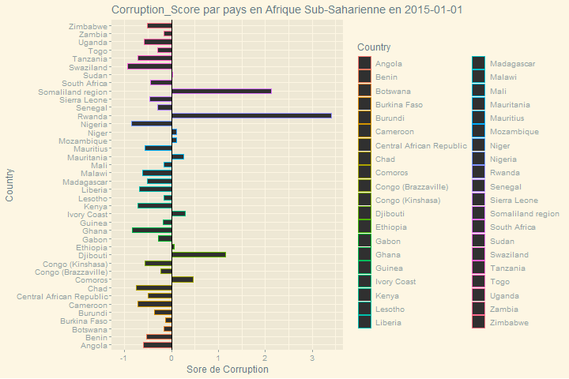
</center>

Dans l'ensemble le *Score de corruption* évolue dans le négatif. Il n'y a pas d'observation commune générale. En effet, les fluctuations semblent dépendre des pays. De plus, il est important de noter que certains pays ne sont présents que pour certaines années, ainsi suivre une évolution n'est pas possible. En revanche, il est possible d'observer l'évolution complète de certains pays comme le ***Burundi*** et le ***Lesotho***. Ceux-ci ont des comportements très opposés.


Pour le ***Lesotho***, on observe un *Score de corruption* négatif, qui augmente entre 2015 et 2018 et qui baisse de manière drastique à partir de 2020. En effet, cette monarchie constitutionnelle, se composant d'un parlement bicaméral, n'a durant la crise du covid déclaré aucun cas suspect jusqu'en mai 2020. Néanmoins, ce pays de 2 millions d'habitants n'avait aucun kit de dépistage avant avril 2020 et ils n'ont pu accéder à la vaccination complète qu'en 2022. De plus, le ***Lesotho*** est le dernier pays d'***Afrique*** à avoir signalé un cas de covid pendant la pandémie. Ainsi, cette baisse drastique en 2020 peut s'expliquer par la crise du covid et donc le manque de confiance générale de la population envers son gouvernement.


En ce qui concerne, le ***Burundi***, on observe une hausse du *Score de corruption* en 2018. Le ***Burundi***, est une république constitutionnelle. D'ailleurs, en 2019, ***Gitega*** la deuxième plus grande ville du pays, est devenue la capitale politique. En effet, le Sénat, ainsi que la présidence s'y sont installés. De plus, un événement qui pourrait expliquer cette hausse du *Score de corruption* est la révision faite en 2018 de la constitution. Celle-ci propose l'intégration d'un Premier ministre par exemple. Néanmoins, toutes ces observations sont à prendre avec du recul. En effet, cette constitution inclut également le passage du mandat présidentiel de 5 à 7 ans. Par ailleurs, les opposants estiment avoir été bâillonnés et décrivent un climat de peur lors du referendum.

Ainsi, on peut donc conclure qu'en Afrique l'évolution du *Score de corruption* est  propre au pays étudié.


```{r}
#Enfin, on créer ici une fonction qui permet de générer un graphe qui choisi aléatoirement les pays étudiés dans la région désignée, le nombre de pays renseigné et le paramètre voulant être étudié. Cette fonction est donc très utile pour la shinyapp puisque complètement dynamique.

df_evolution_country_by_region <- function(param, region, nbPays){
  df_2015_to_2021 <- data.frame()
  # Grouper par régions avec le paramètre et l'année correspondants 
  for (i in list(df2015, df2016, df2017, df2018, df2019, df2020, df2021)){
    df_2015_to_2021 <- rbind(df_2015_to_2021, i[,c('Year', 'Country', 'Region', param)])
  }
  
  # Filtrer par région choisie
  df <- df_2015_to_2021 %>% dplyr::filter(Region %in% region)
  
  # Si le nombre de pays choisi est supérieur au nombre réel de pays dans la région, alors on donne tous les pays de la région
  if (nbPays < length(unique(df$Country))){
    pays_random <- sample(unique(df$Country), nbPays, replace = F)
  }
  else {
    pays_random <- sample(unique(df$Country), length(unique(df$Country)), replace = F)
  }
  
  
  df_pays_random_in_region <- df %>% dplyr::filter(Country %in% pays_random)
  df_pays_random_in_region$Country <- as.factor(df_pays_random_in_region$Country)
  df_pays_random_in_region$Region <- as.factor(df_pays_random_in_region$Region)

  df_pays_random_in_region
}


# Fonction pour générer des barplots avec des pays aléatoires au sein d'une même région
make_barplot_region <- function(param, region, nbPays){
  
  # Appel de la fonction créée précédemment
  df_pays_random_in_region <- df_evolution_country_by_region(param, region, nbPays)
  
  for (year in unique(df_pays_random_in_region$Year)){
    
    df_year <- df_pays_random_in_region %>% filter(Year == year) 
    
    # Création du plot
    p <- df_year %>% ggplot(aes(y=get(param), x=Country, color=Country)) + geom_bar(stat='identity', width=0.5) + geom_hline(yintercept = mean(df_year[, param]), linetype = "dashed", color='red') + geom_hline(yintercept = 0) + ylab(param) + ggtitle(paste(param, "de tous les pays en", year)) + coord_flip()
    
    # impression du plot
    print(p)
  }
}
```


### B.13) Violin Chart
Après avoir analysé les différentes répartitions des scores de bonheur entre les différentes régions du monde, nous pouvons nous demander comment sont répartis l'espérance de vie qui est très corrélée linéairement avec le score de bonheur, et la générosité, qui ne l'est pas. 

#### B.13.1) Violin chart sur l'*Espérance de vie* au sein des régions du monde
Commençons avec l'espérance de vie. Nous savons que cette variable est très corrélée linéairement au bonheur, nous devrions ainsi retrouver une répartition très similaire aux différentes visualisations que nous avons décrites auparavant.
```{r, results='hide'}
# Génération d'un violin chart selon le score d'espérance de vie
df <- df2015 %>% filter(!Region == 'NA')

# utilisation du package gapminder et de sa fonction ggbetweestats
boxviolon <- ggbetweenstats(
  data= df, 
  x=Region, 
  y=Life_Expectancy_Score,results.subtitle = FALSE,
  title=paste("Violon Chart représentant l'Espérance de vie \npour toutes les régions  en ", unique(df2015$Year)), 
  pairwise.comparisons = FALSE
  ) + 

theme_wsj() +
  
  # Changement du thème pour rendre la lecture plus agréable
 theme (
  title = element_text(size = 40), 
  legend.position = 'right',
  legend.direction = "vertical",
  legend.key.size = unit(2, "cm"),
  legend.text = element_text(size = 20), 
  axis.title.y = element_text(size = 20),
  axis.text.x = element_text(size = 12, face = 'bold'),
  panel.background = element_rect(fill = '#E0DAC9')
  ) + ylab("Score d'Espérance de Vie")

# Enregistrement du plot en png
png(file = "img/boxviolin/2015_lifeExpectancy.png", width= 1920, height = 1080)
print(boxviolon)
dev.off()
```
<center>
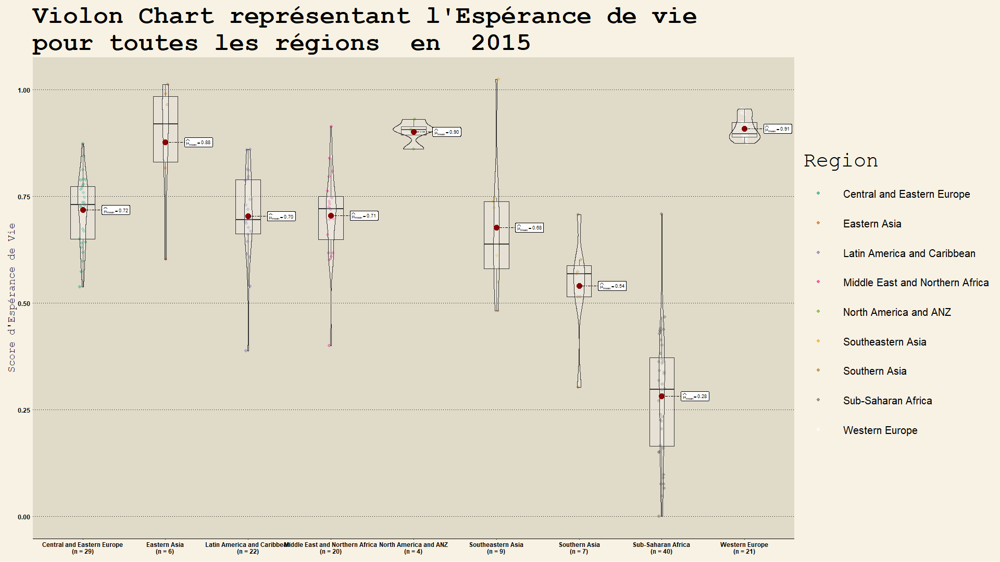
</center>

Sur ce *diagramme en violon*, nous pouvons obtenir la moyenne de *l'espérance de vie*, la *médiane* ainsi que les *extremums* pour chaque région du monde dans notre jeu de données.

Pour commencer notre analyse, il faut soulever la très grande disparité qui peut exister entre certaines régions. La première, et la plus notable, et celle entre l'***Europe de l'Ouest*** et l'***Afrique Subsaharienne***. Placés tout à droite de cette visualisation, la première région possède une répartition très faible de l'espérance de vie et comporte la moyenne la plus haute avec$\mu = 0.91$. À contrario, la seconde, qui placée juste à côté, trouve sa moyenne $\mu = 0.28$ au plus bas de toutes autres régions. Sa répartition en revanche, montre que l'***Afrique subsaharienne*** est très inégale concernant l'*espérance de vie*. On retrouve ainsi le pays avec le plus grand score au même niveau que la plupart des régions du monde, mais la moitié de tous les pays de cette région trouvent son score d'*espérance de vie* en dessous de tout ce qui existe dans les autres régions du monde.

Dès lors, nous pouvons considérer que l'***Afrique subsaharienne*** est la région avec le plus faible niveau d'espérance de vie. En cause, sa situation sanitaire très instable. Cette instabilité peut être induite par de multiples facteurs comme des maladies létales type **paludisme** ou **choléra**, qui peuvent proliférer faute de systèmes de santés et stables, mais aussi et tout simplement par le très faible *PIB par habitants* au sein de cette région du monde.

Une autre région du monde possède presque les mêmes caractéristiques que l'***Europe de l'ouest***. C'est ***l'Amérique du nord et l'Australie/Nouvelle-Zélande***. Cette région ne déroge pas à la règle, car possède une fois encore une *espérance de vie* très élevée avec une répartition très faible. Ce qui n'est pas le cas de l'***Asie de l'est***. Bien que cette région possède une moyenne $\mu = 0.88$, les scores des pays sont assez répartis.

Les autres régions du monde possèdent quant à elle des espérances de vie similaires entre elles avec une moyenne d'environ $\mu = 0.7$.

#### B.13.2) Violon Plot mesurant le *Score de générosité* pour toute les régions du monde en 2015

De plus, le scatterplot tracé dans la partie B.2.2), n'a pas permis une observation d'une corrélation linéaire entre la générosité et le PIB, ainsi, il est légitime de se demander si la générosité est culturelle. Pour ce faire, il peut être intéressant de visualiser le score de générosité au moyen de Violon plot pour chacune des régions et s'il est plus ou moins homogène. Nous avons ici fait le choix de n'étudier que l'année 2015.


```{r, results='hide'}
# Génération d'un violin chart selon le score de générosité
df <- df2015 %>% filter(!Region == 'NA')

# utilisation du package gapminder et de sa fonction ggbetweestats
boxviolon <- ggbetweenstats(
  data= df, 
  x=Region, 
  y=Generosity_Score,results.subtitle = FALSE,
  title=paste("Violon Chart représentant le score de générosité \npour toutes les régions  en ", unique(df2015$Year)), 
  pairwise.comparisons = FALSE
  ) + 

theme_wsj() +

 # Changement du thème pour rendre la lecture plus agréable
 theme (
 title = element_text(size = 40), 
  legend.position = 'right',
  legend.direction = "vertical",
  legend.key.size = unit(2, "cm"),
  legend.text = element_text(size = 20), 
  axis.title.y = element_text(size = 20),
  axis.text.x = element_text(size = 12, face = 'bold'),
  panel.background = element_rect(fill = '#E0DAC9')
  ) + ylab("Score de générosité")

# Enregistrement du plot en png
png(file = "img/boxviolin/2015_generosity.png", width= 1920, height = 1080)
print(boxviolon)
dev.off()
```
<center>
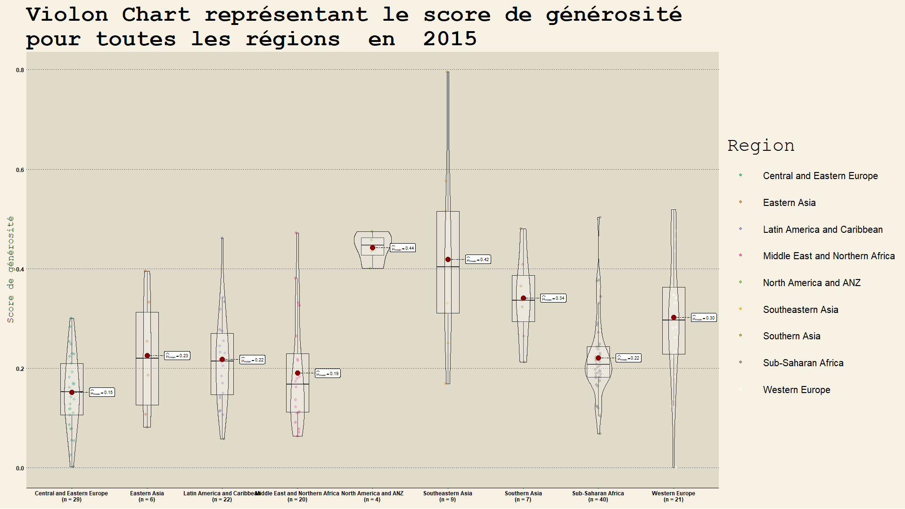
</center>

Le *violin chart* précédent donne la moyenne, l'écart-type ainsi que le nombre de pays au sein des différentes régions du monde en ce qui concerne le *Score de générosité* en 2015.

Notons dans un premier temps que certaines régions ne se composent que de 4 pays, c'est le cas notamment de ***Amérique du Nord et Océanie***. Contrairement à la région ***Europe centrale et de l'est*** qui se constitue de 29 pays. Ainsi, on pourrait dire que donner une interprétation de ce graphique ne serait pas forcément cohérente au vu du nombre d'individus très différents par région. Cependant, rappelons que les ***Etats-Unis*** sont aussi grands que toute l'Europe. Ainsi, il y a certes moins de pays, mais tout autant de population. Tachons de garder, néanmoins, cette information en tête lors de l'interprétation.

De plus, pour interpréter ce graphique, nous partons du principe que chaque région à une culture propre. En effet, nous supposons que deux pays très proches, géographiquement, ont la même culture, même si nous avons conscience qu'il existe de nombreux contre-exemples.

Ainsi, en partant des principes énumérés précédemment, on remarque la région la plus généreuse en 2015 est : ***Amérique du Nord et Océanie***. En effet, la moyenne de cette région est très élevée, et l'écart-type est très faible. Mais celle-ci ne contient pas le pays le plus généreux du monde. En effet, celui-ci se trouve en ***Asie du sud est***, c'est le ***Mynamar*** (ex-Birmanie), comme observé dans la partie B.2.2). Au sein de la région ***Asie du Sud-Est***, la moyenne est très haute, mais l'écart-type l'est tout autant.

En ce qui concerne :

- ***Europe centrale et de l'est***,
- ***Asie de l'Est***,
- ***Amérique latine et Caraïbes***,
- ***Moyen-Orient et Afrique du Nord***,
- ***Afrique Subsaharienne***,

ces régions ont des profils similaires. En effet, leurs moyennes sont proches. Mais surtout, leurs moyennes semblent être des médianes. En effet, il semble y avoir le même nombre de pays au-dessous et en dessous de celles-ci. Ajoutons que pour ***Amérique latine et Caraïbes***, ***Moyen-Orient et Afrique du Nord*** et ***Afrique Subsaharienne*** ont de nombreux pays qui se trouvent autour de la moyenne.


Enfin, en ce qui concerne la région ***Europe de l'Ouest*** et ***Asie du Sud-Est ***, ce sont deux régions avec de haut *Score de générosité*. Cependant, la dispersion est bien plus grande en ***Europe de l'Ouest*** qu'en ***Asie du Sud-Est***.

Ainsi, il n'est pas possible de réellement conclure concernant cette question, non pas à cause de la visualisation, mais à cause du dataset et de la définition de "*culture*". En effet, comme souligné auparavant deux pays proches, géographiquement, n'ont pas forcément la même culture. Dans notre dataset par exemple, la Suisse et l'Italie sont dans la même région : ***Europe de l'Ouest*** et partagent des frontières. Cependant, en ***Italie***, la culture est latine alors qu'en ***Suisse***, elle est plus germanique.
Afin, d'avoir une réelle idée précise de cet indicateur, il aurait fallu étudier au sein d'un même pays la répartition des individus dit "généreux" et mener une étude statistique type ACM et ainsi étudier les clusters de personnes généreuses au sein des pays.

### B.13)LineChart 


#### B.13.1) Line Chart donnant l'évolution du *Score du Bonheur* en Europe en 2015

Dans cette partie, il sera étudié le *Score du bonheur* de 8 pays sélectionné en amont en Europe sur 6 ans à partir de 2015. En effet, ici, le but est d'observer l'évolution *Score du bonheur* au fil des années en ***Europe***. En effet, après étudié la répartition du *Score du bonheur* dans différentes régions via des, *ridge graph* et , il semble intéressant d'étudier l'évolution de celui-ci sur des pays que nous connaissons. Le but sera donc de faire une résumer de l'évolution de cet indicateur à partir de 2015. Nous répondrons à la question :"Comment évolue le *Score du bonheur* dans différents pays d'***Europe*** à partir de 2015 ?".
<center>
```{r}
#Filtrage du dataset en fonction de la région d'Europe de l'Ouest
  data<-df_2015_to_2021 %>% filter(Region=="Western Europe")
#Selection des données voulues 
  data<-select(data,c("Year","Country","Happiness_Score"))
#Filtrage des pays souhaités
  data<-data %>% filter(Country %in% c("France","Switzerland","United Kingdom","Norway","Italy","Portugal","Germany","Greece"))
#Création du ggplotly 
  p <-  ggplot(data) + geom_line(aes(x = Year, y=Happiness_Score, group=Country, color=Country))+ggtitle("Score du Bonheur de différents pays en Europe à partir de 2015")+ theme_solarized_2() +
      theme(plot.title=element_text(size=10))+
        xlab("Année")+ylab("Score du Bonheur")
  ggplotly(p)
  
```
</center>

Tout d'abord, on remarque qu'il y a 4 groupes. En effet :

- Groupe 1: ***la Suisse et la Norvège***
- Groupe 2: ***Royaume-Uni et l'Allemagne***
- Groupe 3: ***France et l'Italie***
- Groupe 4 : ***La Grèce et le Portugal***

ont des *Score du bonheur* très similaires. Ces groupes sont classés par ordre décroissant de *Score du bonheur* i.e., le groupe 1 a un score plus élevé que le groupe 2, etc.

Dans l'ensemble, il y a une hausse du *Score du bonheur* au fil des années. Celle-ci est plus ou moins significative selon le groupe.

En ce qui concerne, le groupe 1 la hausse est très légère. En effet, les courbes de la ***Suisse et la Norvège*** sont assez stables et hautes par rapport aux autres pays. Néanmoins, on observe une très légère baisse en ***Norvège*** depuis 2018. Cette baisse s'est accentuée notamment en 2020. Ceci est certainement dû à la crise du covid, néanmoins cette baisse reste légère. En effet, la manière dont la crise a été gérée fut exemplaire puisque la ***Norvège*** était l'un des pays avec l'indice de résilience au covid le plus élevé. C'était l'un des pays d'***Europe*** où il faisait bon vivre même lors de l'ère du coronavirus. Ceci est certainement dû aux *PIB* très élevés du pays qui a ainsi eu les moyens d'apporter les soins nécessaires à sa population. De plus, notons qu'il y a une grande différence d'éducation des populations entre Pays d'***Europe du Nord*** et d'***Europe du Sud ou de l'est***. En effet, les populations des pays scandinaves et ***Suisse*** sont réputées pour être plus responsable et appliquer les conseils de leurs gouvernements.

Au sein du groupe 2, on remarque que le ***Royaume-Uni*** a eu une très grande hausse entre 2017 et 2018 contrairement à ***l'Allemagne*** où le *Score de bonheur* est constant sur les six années. En effet, le 17 mars 2017 *Theresa May*, ancienne première ministre du ***Royaume-Uni***, annonce officiellement son intention de se retirer de l'Europe. En 2018, il subsiste encore une grande incertitude à propos du Brexit, mais Theresa remporte une voix de défiance. De plus, on remarque une grande fluctuation au ***Royaume-Uni***, de 2020 à 2021, en effet, 54% de la population du ***Royaume-Uni*** estime ne pas etre satisfait de la gestion du covid par leur gouvernement contre seulement 12% en ***Allemagne*** (Source: [Statista](https://fr.statista.com/infographie/21773/opinion-publique-gestion-crise-coronavirus-gouvernement-france-comparaison-pays/);  Comment le gouvernenement a-t-il géré la crise).

Le groupe 3 se compose de la ***France*** et de l'***Italie***. On remarque étonnement une grande hausse du *Score de bonheur* entre 2018 et 2021. Cette hausse se confirme par une enquête menée par *Statista* qui montre que 60% des Français en 2020 étaient satisfaits de la gestion de la crise du covid contre 74% en ***Italie***. De plus, cette période bien que triste a permis à beaucoup de personnes de se recentrer, se retrouver, méditer et prendre le temps de réfléchir à leur vie et leurs futurs projets. En effet, comme a dit le sociologue *Jeffrey Sachs*:"Il n'est pas sûr que le monde soit plus heureux maintenant, mais le monde est plus axé sur le bonheur et le bien-être qu'il ne l'était il y a dix ans. Et cela en soi nous offre un espoir que nous pouvons transformer cette meilleure compréhension en un vrai bonheur dans le monde". Cette période a permis un bon nombre de reconsidérations dans la vie des populations. En effet, il y a eu énormément de reconversions et une prise de conscience de la pénibilité de certaines professions comme celle du corps médical ou bien des éboueurs par exemple.

Le groupe 4 se compose de la ***Grèce et du Portugal***. Ces deux pays ont tout deux la même tendance croissante. Mais restent tout de même avec des *Score de bonheur* beaucoup plus faible que les autres pays. En effet, de part le* corplot* partie B.6, on sait que le *Score de bonheur* est très corrélé linéairement au *PIB*. Or les *PIB* du ***Portugal*** et de la ***Grèce ***sont parmi les plus faibles d'Europe de l'Ouest. En effet, la ***Grèce*** a notamment été victime de la crise économique de 2008. Rappelons que cette crise a eu de lourdes conséquences puisqu'il y eut une forte hausse des prix du pétrole et des produits agricoles. La cause de cette crise semble provenir d'une période de crédit facile. Ainsi, la ***Grèce*** essaie de manière fragile de conserver sa croissance même si celle-ci a été très menacée par la crise du covid de 2020.


Ce graphique est en cohérence avec la géographie des pays en ***Europe***. En effet, plus le pays est au sud et à l'est moins il est heureux. Rappelons, que le *PIB* est très corrélé au *Score du bonheur*, et que le *PIB*des Pays d'***Europe de l'Est et du sud-est*** bien plus faible que les pays d'***Europe de l'Ouest et du Nord***.


#### B.13.2) Création d'une fonction réalisant un line chart avec un sample de pays en fonction du paramètre étudié dans une région donnée

Dans cette partie, il a été codé une fonction permettant de créer des *line Chart* dynamique. Cette fonction sera notamment utile pour l'application shinyApp. Nous l'utiliserons notamment pour répondre à la question posée dans la partie B.4: "Y a t il eu une réelle baisse du *PIB* de 2019 à 2020?".

<center>

```{r}
#Création d'une fonction donnant un line chart en fonction de la région, du nombre de pays et du paramètre choisi.
set.seed(1)
make_line_chart_region <- function(param, region, nbPays){

#Appel fonction df_evolution_country_by_region commentée précedemment
    df_pays_random_in_region <- df_evolution_country_by_region(param, region, nbPays)
    p <-  ggplot(df_pays_random_in_region) + geom_line(aes(x = Year, y=get(param), group=Country, color=Country))+
    ggtitle(paste(param,"de différents pays en ",region, " à partir de 2015"))+ theme_solarized_2() +
      theme(plot.title=element_text(size=10))+
    ylab(param)
    ggplotly(p)
}

make_line_chart_region("GDP_Score", "Sub-Saharan Africa", 9)
```
</center>

Le LineChart précédent montre bien une baisse générale du *PIB* de 2019 à 2021. Cette baisse est observée également pour la ***Mauritanie*** qui est l'un des pays les plus riches ***d'Afrique sub-Saharienne***.


### B.14) RadarChart

Le RadarChart peut permettre d'observer, comparer un paramètre choisi tel que le *Score social* entre différents pays. Ici, nous avons fait le choix d'étudier deux graphiques. Comme montré précédemment dans la partie B.6), le *Score social* est corrélé de manière générale linéairement au *PIB* et à l'*Espérance de vie*. Il est ainsi légitime de se demander comment est réparti le *Score social* en Afrique par exemple. En effet, nous avons observé précédemment via une *treemap* que le *Espérance de vie* était très différent selon les pays. En est-il de même pour le *Score social* ? Pour observer au mieux les différents *Score social* un *Radar Chart* sera utilisé.

Rappelons que le *Score social* mesure notre entourage, c'est-à-dire le nombre d'amis, le nombre de membres dans la famille, les personnes proches, celles qui nous entourent au quotidien.

Dans un premier temps, nous utilisons une fonction dynamique qui sera utilisée dans la ShinyApp.

Appliquons la fonction à l'***Afrique Sub-Saharienne*** en 2015 :

```{r}
#Param peut prendre Happiness_Score, Generosity_Score, GDP_Score, Expectancy_Score

RadarFunc<-function(annee,region,param,axe){
data<-select(annee,c("Region","Country",param))
data2<-data %>% filter(Region==region)
data<-data2[,3]
data<-as.data.frame(data)
up<- 2
down<-0
data <- cbind(rep(up,nrow(data)) , rep(down,nrow(data)) , data)
data<-as.data.frame(t(data))

colnames(data)<-data2$Country
radarchart(data, axistype=1 , title=paste("Radarchart représentant le",param,"en",region,"en",unique(annee$Year)),
 
    #custom polygon
   pcol = 4, pfcol=rgb(0, 0.4, 1, 0.25) , plwd=2 , 
 
    #custom the grid
    cglcol="grey", cglty=1, axislabcol="grey", caxislabels=seq(0,2,0.5), cglwd=0.8,
 
    #custom labels
    vlcex=0.8)
    
}

```


```{r, results='hide'}
png(file = "img/radar_func.png", width = 1080, height = 720)
print(RadarFunc(df2015,"Sub-Saharan Africa","Social_Score"))
dev.off()
```
<center>
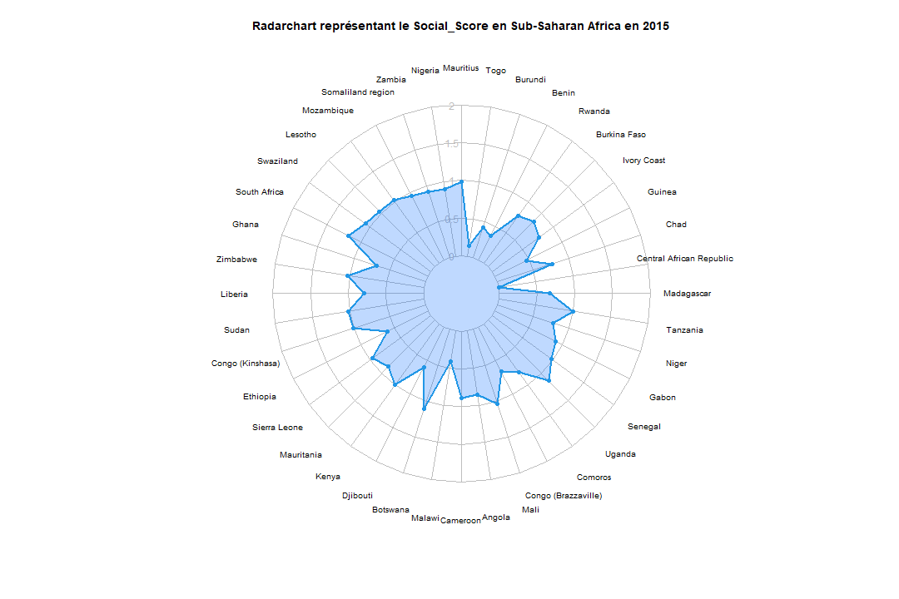
</center>

Le *Radar plot* met en évidence de faible *Score social* en ***Afrique sub-saharienne***. En effet, les scores se trouvent tous en dessous de 1. Les pays ayant un score élevé sont :

- ***La Mauritanie***,

- ***L'Afrique du Sud***,

- ***Le Lesotho***,

- ***Djibouti***,

- ***Le Sénégal***,

- ***La Tanzanie***,

- ***Botswana*** etc.,

Ce sont tous des pays qui ont un *Score de PIB* supérieur à -1.5. Contrairement à Centre Afrique qui a un *Score social* nul et d'un *Score de PIB* très faible également.
Ainsi, en 2015, en ***Afrique***, on peut remarquer une certaine corrélation linéaire même si le taux d'accroissement de celle-ci est petit. Ainsi, plus un pays est riche et plus l'entourage d'une personne est grand. En effet, cela peut s'expliquer que lorsque le pays est riche les habitants peuvent avoir d'autres activités que de travailler pour assurer une rentabilité et ainsi plus sociabiliser et avoir un cercle de connaissance plus large.

```{r}
df<-df2015 %>% filter(Region=="Sub-Saharan Africa")
cor(df$Social_Score,df$GDP_Score)
```


## C) Conclusion

Ce projet a été une bonne première approche afin d'explorer, découvrir ces datasets. En effet, nous avons pu réaliser de multiples visualisations dans le temps à partie qui ont permis de donner une idée des liens entre les variables et les individus plus ou moins évidents. Nous avons pu par exemple, découvrir qu'il existait une forte corrélation linéaire entre l'espérance de vie moyenne, le bonheur et le PIB du pays. En effet, cela semble logique, plus un pays est riche, plus l'état peut subvenir aux soins et aux besoins des malades et les populations sont ainsi plus heureuse. Par ailleurs, nous avons pu remarquer par le biais de *scatterplot, ou des corplot* que le score de corruption était très faiblement lié linéairement au score de bonheur, de même pour le PIB et le score de générosité qui ne sont pas du corrélés. Cette observation fut étonnante puisqu'on pourrait penser que moins un pays est corrompu et plus les populations sont heureuses, et que plus un pays est riche plus celui-ci est généreux. Ce genre de situation met en évidence qu'il faut faire attention aux visualisations. En effet, ce n'est pas parce qu'il n'y a pas de lien **linéaire** entre deux variables, qu'il n'y a pas de lien. De plus, les visualisations se basent sur un dataset crée par un organisme, celui-ci a donc dû faire des choix au niveau du calcul des scores par exemple, mais également du découpage du monde en région. Et c'est avec ce genre de considérations que l'on s'aperçoit des limites des visualisations. Celles-ci permettent de donner une première idée, une première vue, afin d'avoir un a priori sur le dataset et d'orienter le choix de test statistiques qui pourraient être ensuite pertinentes à mener. Mais on ne peut en aucun conclure avec une seule visualisation. Ceci est très clairement visible notamment avec la visualisation partie B. de *treemap*. En effet, nous avions observé via un *scatterplot* représentant tous les pays que globalement la moyenne de l'espérance de vie était très corrélée au PIB. Ainsi, le but de la *treemap* était de visualiser si cette observation était similaire au sein des pays en Afrique sub-saharienne. On s'est très vite aperçu que non avec l'exemple du Botswana qui a un très haut PIB en Afrique, mais qui pourtant en 2015 avait l'espérance de vie la plus faible d'Afrique. Pour finir, nous allons chacun donner trop un ressenti à propos du projet :

**Ambre**: Pour ma part, j'ai trouvé ce projet très intéressant et très complémentaire d'autres ues telles que MT15, FQ03 ou SY02 par exemple. En effet, venant de génie industriel, j'avais déjà utilisé R auparavant, mais seulement pour effectuer des tests statistiques et algorithmes type heuristique ou de machine learning non supervisé, c'était donc très intéressant d'apprendre à utiliser les packages de visualisation et d'ainsi ajouter une corde à mon arc. De plus, j'ai pu apprendre beaucoup de par les visualisations et les recherches annexes qu'elles m'ont menées à faire. Enfin, je pense que ce genre d'ue est essentielle de part la demande que j'ai pu observer dans les divers entretiens de stage.


**Dorian**: Réaliser ce projet sur le bonheur dans le monde a été pour moi très enrichissant. Que ce soit d'un point de vue technique, car j'ai pu grandement approfondir mes connaissances dans le langage R, mais aussi du point de vue culturel. En effet, nous avons pu développer nos compétences autour d'un thème que nous avions choisi et qui comptait pour nous. En effet, analyser sous tous les angles comment était réparti le bonheur dans le monde m'intriguait énormément. Je désire m'orienter vers les métiers de la Data Science et c'est pourquoi avoir pu réaliser un projet d'une telle envergure sur l'étape de réalisation de visualisation pour en tirer des informations/interprétations sera un réel atout dans ma future carrière. 


**Ismael**: Ce projet a été pour moi très intéressant. En effet, il m'a d'abord permis d'acquérir des compétences techniques avec l'apprentissage du langage R. J'ai aussi pu découvrir l'environnement de développement RStudio que je n'avais jamais utilisé ainsi que la marche à suivre pour créer des rapports avec les fichiers rmd.
La visualisation de données n'est pas nécessairement ce que j'affectionne le plus, cependant, ce projet m'a quand même permis de comprendre la "puissance" de ses langages pour faire parler les données. J'ai aussi pu découvrir de nouvelles visualisations très utile que je ne connaissais pas, comme les treeMaps.

## Bibliographie
https://www.kaggle.com/datasets/ajaypalsinghlo/world-happiness-report-2022
https://worldhappiness.report/)

### Partie B.1.6)
https://www.transparency.org/en/cpi/2020

### Partie B.2.1)
https://www.npr.org/sections/goatsandsoda/2015/11/28/457101304/youll-never-guess-the-most-charitable-nation-in-the-world?t=1654435100743


### Partie B.4.2)
https://towardsdatascience.com/a-statistical-analysis-of-social-urban-and-national-factors-that-affect-citizen-happiness-c24ed0e87dcf

### Partie B.8.2)
https://www.amnesty.org/fr/latest/research/2019/02/human-rights-in-the-middle-east-and-north-africa-2018/


### Partie B.11.1)

- https://perspective.usherbrooke.ca/bilan/servlet/BMAnalyse?codeAnalyse=2154
- https://perspective.usherbrooke.ca/bilan/servlet/BMAnalyse?codeAnalyse=2154
- https://fr.wikipedia.org/wiki/Liste_des_pays_par_esp%C3%A9rance_de_vie


### Partie B.12.2)

- https://rusi.org/explore-our-research/publications/commentary/somaliland-power-democracy
- https://www.unodc.org/documents/corruption/WG-Prevention/Art_5_Preventive_anti-corruption_policies_and_practices/Djibouti.pdf
